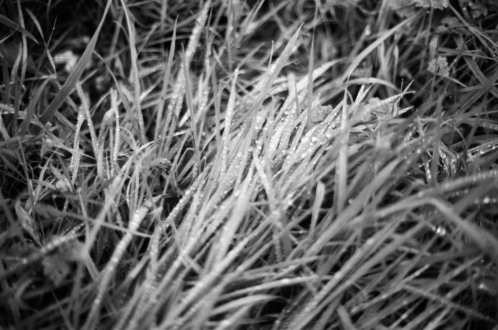

# **TERZO LUOGO  **  
*Un’intervista a Gilles Clément di Michele Bee*  
 
  

 
**MB**:*Tu dici che ogni intervento genera un abbandono. Che cosa intendi dire con ciò?*  
**GC**: Intendo dire che nel prevedere gli interventi, le trasformazioni, le costruzioni rispetto alla superficie di un terreno, non teniamo conto del terreno stesso. Fabbrichiamo un oggetto, abbiamo l’autorizzazione per farlo su uno spazio e facciamo quello che possiamo su tale spazio. Ma di quello che accade nei limiti, nella periferia – dove non possiamo fare nulla perché non è comodo, perché la geometria non lo permette – non ce ne curiamo, ce ne dimentichiamo, ed esso diventa un terzo paesaggio, un terreno abbandonato.     
Vi sono anche altre ragioni dell’abbandono, ma questa è una ragione sistematica, incosciente e meccanica: essa va di pari passo con la crescita della città in un tessuto largo. Se il tessuto fosse denso ciò non accadrebbe. E nella città antica ciò non accade mai. Non ci sono spazi tralasciati nella città storica, perché le case sono attaccate le une alle altre, perché le strade passano tutt’intorno alle case. Ma nella costruzione della città moderna si mette un immobile qua e un altro là, qualche volta si fa la strada e si mette la casa un po’ dietro. Allora si generano dei piccoli spazi che non sono per nulla sfruttabili. Quando non lo sono e nessuno se ne interessa, essi diventano degli spazi abbandonati.  
   
**MB**: *È bene che vi siano degli spazi abbandonati, dimenticati?*  
**GC**: È sempre bene che vi siano degli spazi abbandonati che fungano da rifugio per una diversità che in ogni caso è scacciata altrove. Questo è sempre bene. Ma quando questo paesaggio – il terzo paesaggio – è, diciamo, messo in scena in un modo che non è molto felice, molto gradevole, allora gli abitanti sono spinti a dire: “Ma cos’è questo? Non è bello. Queste sono erbacce!”. Insomma, vi è il rischio dovuto all’ignoranza circa il suo contenuto reale, la ricchezza che esso rappresenta. È lì che bisogna fare pedagogia. Ciò impone un cambiamento di modello culturale e la necessità di spiegare a tutti la ricchezza che lì esiste, affinché essa sia accettata.  
 
**MB**: *Potremmo generalizzare questo discorso, dicendo che ogni intervento, anche amministrativo, anche del potere, pur non volendo produce un’eccedenza di libertà, uno spazio di libertà?*  
**GC**: In realtà, ci sono casi in cui la costruzione, la fabbricazione di un assetto, non produce abbandono. Ciò è assai raro ma può accadere. In tali occasioni, la questione non si pone. Non si producono luoghi trascurati poiché non c’è più spazio: si è nel tessuto denso. Oggi ciò riguarda la città che si ridensifica. Per evitare la dispersione, ci sono sempre più teorie della ridensificazione della città. Ma ci può essere anche un intervento in uno spazio molto aperto, rurale, dove è stata integrata la ricchezza biologica nello spazio ed è stato fatto un intervento che è sufficientemente ben proporzionato rispetto al terreno, tale che il terreno stesso divenga interessante. 
Qui, alle Manifatture Knos, vi è un immensa spianata, che ha dell’incredibile dal punto di vista delle proporzioni. È un terreno che è stato abbandonato da un’attività, che non ha un’identità d’uso, oltre che come parcheggio. In realtà, è un parcheggio vuoto. Ma in realtà è uno spazio sufficientemente grande perché vi si possa fare qualcosa. Quindi, rischia di non essere uno spazio abbandonato, in senso meccanico, storico, della fabbricazione dell’abbandono urbano, ma sarà sicuramente uno spazio recuperato per qualcosa di interessante.  
  
**MB**: *È possibile immaginare una politica che lasci coscientemente, nella sua azione, qualcosa che le sfugge? Sarebbe questa una buona cosa?*  
**GC**: Convincere il politico a organizzare la sua città e a gestire i suoi concittadini attraverso uno spazio d’indecisione è molto difficile. Perché il politico ha sempre il sentimento del potere. Vuole padroneggiare, sempre. E gli sarebbe insopportabile altrimenti.
Ma si può offrire al politico lo strumento “terzo paesaggio”, che corrisponde per lui alla possibilità di decidere che in tale o tal altro luogo non si fa nulla. Lui decide. Decide che non si fa nulla. Non si tratta di una sua indecisione, ma di una sua decisione. Egli decide che vi sarà uno spazio di indecisione, uno spazio in cui non si sa che cosa accadrà. Ma è comunque molto importante lasciargli l’illusione di aver deciso qualcosa (risata).  
 
**MB**: *Perché è importante che vi siano degli spazi in cui non si fa nulla?*
**GC**: È importante non fare nulla nella maggior parte delle situazioni, della città, della campagna, perché lì dove non si fa nulla arriva una serie di specie animali e vegetali che s’installano e che non possono insediarsi altrove. Non possono installarsi nei luoghi in cui l’uomo lavora, dove l’uomo smuove il suolo, dove ci sono industrie, strade, superfici sterilizzate: ciò non è possibile. Ma lì è possibile. Ora, questi spazi non sono molto grandi, non ce ne sono molti. E noi abbiamo bisogno della diversità. Noi dipendiamo da questa diversità, perché la sfruttiamo in permanenza. Evidentemente, non ne sfruttiamo tutto, ne sfruttiamo pochissimo. Ma noi non sappiamo di cosa è fatto il futuro. E può darsi che avremo bisogno di attingere da questo tesoro la possibilità di trovare qualcosa che rappresenta il nostro futuro: un nutrimento, un’energia, un tessuto, una materia qualunque. Ma certamente non è una necessità quella di sfruttare tutto.    
Bisogna che vi sia un territorio d’indecisione – e questa è un’altra ragione – anche affinché arrivino in quel posto quelli che chiamiamo gli ausiliari del giardiniere. Cioè, gli insetti, gli animali che ci aiutano nel territorio che sfruttiamo. Per esempio, un piccolo orto è tanto più equilibrato ecologicamente quanto più intorno a lui vi è uno spazio – tanto meglio se largo – di terzo paesaggio, cioè d’indecisione. Infine, la terza ragione, molto importante, è che lì si trova il pool genetico, la ricchezza genetica a partire dalla quale qualcosa si produrrà nel futuro: è il territorio dell’invenzione, della vita.  
Quante più specie differenti ci sono, tante più sono le opportunità che accada qualcosa di speciale. È meglio avere una ricchezza genetica di base, per avanzare nel futuro, piuttosto che avere una ristrettezza genetica.  
 
**MB**: *Questo discorso sull’indecisione è fondamentale solo per le piante e gli animali oppure lo è anche per gli esseri umani?*  
**GC**: Questo discorso sull’indecisione, sul terzo paesaggio, sullo spazio – diciamo – libero e sul quale si fa attenzione a non fare nulla, è importante per tutti.  
Noi siamo degli esseri appartenenti a questa diversità di cui parlo. Quindi, anche noi, in quanto esseri umani, abbiamo bisogno di uno spazio mentale d’indecisione, di uno spazio mentale di speranza, nel quale qualcosa che non abbiamo previsto può accadere. 
Ciò che non prevediamo può sempre accadere anche in un territorio organizzato, ma ha luogo più verosimilmente in un territorio che non lo è. Quindi, ne abbiamo bisogno: abbiamo bisogno di accogliere le piante e gli animali che non hanno spazio altrove, ma anche gli umani che non trovano la loro configurazione in uno spazio organizzato dal quale si sentono esclusi, scacciati. Anche questo è importante. Quindi, è possibile usare la metafora del terzo paesaggio, dicendo che a ogni modo si tratta anche di un modello di società. 
Ma anche al di fuori di ciò, penso sia una necessità – tra l’altro per tutti molto difficile da definire – che ha una dimensione poetica particolare. E questa dimensione è sentita assolutamente da tutti. E là non ci sono né poveri né ricchi, non ci sono classi: non c’è nulla di tutto questo. Siamo veramente al margine – indeciso – del territorio mentale dell’umano.  
 
**MB**: *Abbiamo parlato di piante, di animali, di esseri umani in generale. Questo discorso può avere senso anche quando parliamo dei bambini, dell’educazione? Che cos’è la pedagogia per Gilles Clément?*  
**GC**: Vi è una forza straordinaria in un territorio abbandonato, una forza pedagogica attraverso il gioco. È un territorio ludico per eccellenza. I bambini lo sanno benissimo.  
Un tempo, in francese si usava l’espressione “terrain vague”. Si tratta di un terreno abbandonato in cui vi sono state delle attività di cui restano tracce, materiali, a volte pezzi di legno o pezzi di ferro. E i bambini ci vanno. Ci vanno per fare qualcosa che è una specie di costruzione, che è un gioco, ma che è anche l’espressione della loro creatività.  
È esattamente ciò che succede alle Manifatture Knos. Solo che sono un po’ più organizzate e non si tratta di bambini molto piccoli: sono dei bambini più grandi (risata) che fanno qualcosa che è l’espressione della loro creatività. Possono farlo con delle ruote di bicicletta, che vengono riparate, ma possono farlo anche con pezzi di legno oppure con oggetti di recupero. È un terrain vague magnifico.  
Ecco allora il “terzo luogo”. Qui siamo nel terzo luogo più che nel terzo paesaggio, nel suo senso originario, perché il terzo paesaggio nel suo senso originario riguarda piuttosto la biodiversità non umana. Ma qui siamo in uno spazio di libertà che interessa direttamente l’uomo e soprattutto i bambini.   
Direi che l’opposto di tutto ciò, l’opposto deciso, l’opposto veramente voluto dal mercato, è la fabbricazione dei giocattoli. Si fabbricano dei giocattoli, di plastica, di tutti i colori, automatici, che si rimontano, che lampeggiano, che sono non so che, e lì è finita. Lì, il bambino è il consumatore di un qualcosa che è stato immaginato da qualcun altro e che lo si obbliga a consumare. Non è per nulla la stessa cosa. E lì lui è morto, è finito. Ci vorrà molto tempo per risvegliarlo.  
Mentre, nel momento in cui è immerso in uno spazio di libertà – in un “terzo luogo”, come tu lo definisci – a quel punto è davvero obbligato a riflettere a ciò che farà con ciò che ha sottomano. Diventa un creativo. Diventa autonomo attraverso il proprio pensiero. È obbligato a pensare da sé. Non è il consumatore del pensiero di qualcun altro, e ciò è importantissimo.  
 
**MB**: *Perché sei qui?*  
**GC**: (Risata) Perché sono qui? Sono qui perché ho ricevuto una bella lettera, voilà.    
Ed è assai raro ricevere una richiesta che è veramente scritta, che è redatta, che propone un soggetto importante. Un soggetto allo stesso tempo di ricerca e di lavoro – in quanto atelier – su una questione, che è oggi una questione politica essenziale. Politica in senso largo, cioè che mette in gioco il modello economico, il che è una questione cruciale, importantissima. Quindi, trovo giusto rispondere a ciò.  
Mi sembra che i luoghi come questo possano apportare delle risposte a delle questioni che tutti si pongono oggi. Ecco cosa ho presentito quando ho ricevuto la lettera.    
 
**MB**: *Quando hai aperto i lavori di questo atelier tu hai detto: “Voi siete gli studenti dell’atelier, ma anch’io imparerò da voi”. Hai davvero imparato qualcosa grazie a questo atelier?*    
**GC**: Sempre, quando insegno, mi rendo conto che imparo delle cose grazie alle questioni poste dagli studenti. Ed effettivamente ho detto questo all’apertura dell’atelier sui tre grandi siti che sono stati proposti, perché ero sicuro di apprendere qualcosa: è obbligatorio.    
Qui, ho imparato allo stesso tempo dai luoghi – i luoghi nei quali siamo andati – perché non li conoscevo e quindi vi erano delle questioni che si ponevano; e poi da quelli che si sono messi in gioco e che hanno emesso delle ipotesi e che quindi, mentre emettevano delle ipotesi, hanno aperto delle questioni. Così, sono arrivate delle cose alle quali non avevo pensato. 
Per esempio, la relazione quasi viscerale che unisce, che lega, alcuni di loro alla città, alla pietra, alle cave. C’è qualcosa di assai irrazionale e che per me era inatteso, ma che allo stesso tempo condivido. Ho capito delle cose che non avevo veramente capito, ma che condivido del tutto.  
Rispetto al Knos, c’è qualcosa che vedo arrivare. Lo spazio di libertà che il Knos rappresenta segna, contamina in un certo modo gli spiriti, offrendo loro un accesso alla libertà che essi stessi non si attendevano. E si ha un ritorno di ciò, dalla parte di persone che sono calme, che non sono qui per fare la rivoluzione. E la fanno. Nonostante tutto. Perché sono andate a fare un buco nel cemento.  
È un po’ il contrario di ciò che è successo con San Cataldo. Perché lì, mi sono chiesto, ma perché si sono messi in una situazione di riserva, dicendo “è impossibile, è possibile”, cioè facendo una classificazione tra ciò che è possibile e ciò che è impossibile. Non mi aspettavo nulla del genere. E ho capito che si trattava di qualcosa che è legata al modo di percepire il politico e il potere in Italia. Qualcosa che io non conosco. Quindi mi rendo conto, qui, che forse ci sono molte più impossibilità di quanto io non creda. Ma, visto che io non sono italiano, forse posso permettermi di sognare, più forte forse. Ciò non significa che non ho imparato qualcosa.  
 
**MB**: *E che ne pensi allora dell’Italia? Come ti sei sentito durante questi giorni in Italia?*  
**GC**: Particolarmente bene qui, particolarmente bene a Lecce. Ma ciò ha a che fare con l’accoglienza, con le persone. È molto difficile da spiegare.  
Allo stesso tempo, condivido con l’Italia in generale qualcosa di immediato. Ho l’impressione di essere a casa. Ma vi scopro sempre delle cose che non conoscevo per nulla, che sono completamente nuove per me: dal cibo, al modo di vivere. Ma ciò non pone alcun problema in alcun momento. E poi c’è qualcosa di assai gioioso e c’è l’umorismo. Quindi, vi sono delle cose molto importanti.  
Ma, senza voler fare una separazione tra l’Italia del nord e l’Italia del sud – perché per me ciò non ha molto senso, se non da un punto di vista climatico o del paesaggio, che è molto differente – c’è comunque una demarcazione culturale importante. Mi sento bene con entrambe, senza alcun problema. Può darsi che qui ho vissuto più in un’euforia. In effetti, qualcosa di un po’ euforico.  
   
**MB**: *Giusto per concludere il discorso di prima in cui abbiamo parlato di spazi di indecisione per le piante, gli animali, gli esseri umani, i bambini. Mi chiedo che cosa potrebbe voler dire essere giardinieri di se stessi.*  
**GC**: Possiamo fare la trasposizione tra l’occuparsi di un giardino e l’occuparsi di se stessi. Del resto, uno dei modi per occuparsi di se stessi è fare un giardino. Perché, facendo un giardino, ci si mette in posizione di equilibrio, fisico e mentale, e ci si mette nella posizione assai particolare di aspettare qualcosa di felice.     
Quando si mette un seme nel terreno, è per domani. Si è tirati verso il futuro. Non si è mai nella nostalgia, e quindi si spera. Si tratta di ciò che chiamo “territorio mentale di speranza”: il giardino. È la mia definizione di giardino. Tra le altre. Ne ho diverse, ma questa è quella che preferisco (risata).     
Giardinare se stessi significa mettersi in equilibrio. Mettersi in equilibrio significa distinguere ciò che in sé è l’ombra e ciò che è la luce, dicendosi che va ugualmente bene l’ombra come la luce, che non c’è alcun problema. Ma bisogna sapere che cos’è l’ombra presso di sé, che cos’è la luce presso di sé. Altrimenti, applicheremo un modello culturale di società che appartiene ad altri e cercheremo di applicarlo a noi stessi; il che non funziona sempre e, direi, non funziona assolutamente mai. Funziona per una collettività, non funziona per un individuo.     
Ci vogliono delle regole per la società, per l’individuo ci vogliono le regole che ciascuno scopre da sé. Significa che ci si mette a cercare in se stessi ciò che ci è più consono. Per arrivarci, bisogna sbarazzarsi di tutto ciò che ci è stato insegnato. Questo è più difficile. A volte è impossibile. Ma c’è qualcosa che può aiutarci a sbarazzarci delle nostre certezze: è il viaggio.     
Quando si viaggia, si vanno a vedere altri modi di pensare, altre culture, altri modelli. E a quel punto, ci si dice: “Ma allora, lì dove ho vissuto, quel modello va bene, ma anche gli altri vanno bene, anche gli altri hanno un interesse, sono ugualmente interessanti”. In quel momento relativizziamo e finiamo per abbandonare tutte le certezze. È l’abbandono delle certezze che permette di svilupparsi. Quando si hanno delle certezze, si è bloccati.   
 
**MB**: *Possiamo dire che c’è un rapporto tra l’equilibrio dell’ecosistema, un equilibrio economico e l’equilibrio interiore?*  
**GC**: C’è un rapporto tra questi equilibri a partire dal momento in cui l’equilibrio economico è un equilibrio che tiene conto degli altri due.  
L’equilibrio economico nelle nostre società è un equilibrio costruito, frutto di riflessione, che è stato oggetto di opere, di pensieri particolari. L’equilibrio biologico di un ecosistema è un equilibrio spontaneo dove non c’è coscienza, non c’è riflessione obbligatoria. L’equilibrio interno è un equilibrio che possiamo dire spontaneo, visto che non si è obbligati a fare un’analisi psicologica di se stessi, si può arrivare intuitivamente a equilibrarsi.
L’equilibrio economico è un equilibrio di società organizzata. Oggi, nello stato attuale delle cose, questo equilibrio economico non è per nulla aggiustato né all’equilibrio biologico né all’equilibrio umano, in alcun momento. Funziona per se stesso, a beneficio di qualche persona, pochissime, e a detrimento di un grandissimo numero. Quindi, questo qui è completamente da eliminare. Bisogna inventarne un altro.  
   
**MB**: *Abbiamo parlato di equilibrio interiore e di essere giardinieri di se stessi. Prendo ancora una metafora per provare a guardare qualcosa: c’è forse un terzo paesaggio dentro ciascuno di noi, nella nostra vita? Qualcosa che sfugge a noi stessi?*  
**GC**: La questione del terzo paesaggio all’interno di sé è una questione che possiamo evocare, penso, a ogni momento perché è il lavoro dell’incosciente. L’incosciente è un fondo, un fondo biologico quasi impalpabile, immateriale, che è d’una straordinaria ricchezza e di grandissima sorpresa. Per ciò che mi riguarda – non conosco benissimo il mio incosciente, poiché il proprio dell’incosciente, in fin dei conti, è di non essere messo in luce dalla coscienza – ho potuto sperimentare la sua potenza attraverso il disegno.  
Il disegno è ciò che ci permette di mostrare l’invisibile. Altrimenti, per ciò che è visibile, prendiamo una foto. Ma quando si disegna, si disegna qualcosa di particolare, che si è scelto e che si estrae dal reale e che si rimette in un altro contesto. Succede che disegniamo senza accorgercene, perché siamo al telefono oppure siamo in una riunione e ci annoiamo davvero molto e così facciamo qualcosa. E tutt’a un tratto vediamo: abbiamo fatto qualcosa.  
Ecco il terzo paesaggio che è in noi. E ci diciamo: “Questo, questo esiste? È mostruoso! È orribile!”. Ma non importa, è interessante (risata). Oppure, al contrario: “Ah, è molto bello!”, non ha alcuna importanza. È qualcosa che non avevamo previsto, che non sapevamo esistesse in noi.  
   
**MB**: *Mi chiedo se l’amore abbia a che fare con la libertà, propria, degli altri, o se sia voglia di avere, di controllare. E così mi chiedo, ti chiedo: che cos’è l’amore per Gilles Clément?*  
**GC**: (Risata) Penso sia qualcosa che si condivide, sono degli istanti in cui si è in accordo assoluto, ed è superiore a qualunque sistema di interesse. È, in effetti, superiore. È anche qualcosa che si pone al di sopra della materialità. Ci sono delle cose che sono materiali e che si possono anche condividere, ma in fondo, nella condivisione dell’immateriale c’è un pegno d’amore nella misura in cui si è senza calcolo e si fa qualcosa per l’altro, perché si pensa sia ciò che di meglio si può fare per l’altro in quel momento.  
   
**MB**: *Il miracolo di parlare agli uccelli, è possibile?*  
**GC**: Sì, penso che sia possibile il miracolo di parlare agli uccelli, ma è più difficile parlare agli umani (risata).
  
