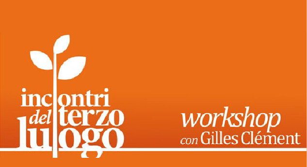

Dal 24 al 27 aprile 2013

Da mercoledì 24 a sabato 27 aprile le Manifatture Knos danno seguito al percorso iniziato lo scorso novembre con il secondo appuntamento del workshop con Gilles Clément Dal terzo paesaggio al terzo luogo.
La partecipazione e l'entusiasmo di tutti gli iscritti e la loro determinazione a portare avanti i progetti messi in cantiere in quella prima occasione hanno reso possibile la prosecuzione di questa iniziativa che ospita come guida e ispiratore Gilles Clément, autore di Manifesto del Terzo paesaggio e Il giardino in movimento.

Si tratta di continuare a lavorare sui luoghi attraverso lo sguardo del terzo paesaggio e del terzo luogo e di pensare a come applicare una politica fondata sulle potenzialità dell'indecisione.

Il workshop mira a continuare e dare concretezza al lavoro iniziato a novembre 2012. Anche questa volta la partecipazione è gratuita e aperta a tutti.
Si continuerà a lavorare in tre gruppi, ognuno dei quali focalizzerà la propria attenzione su uno dei tre luoghi scelti per sperimentare l'idea di terzo paesaggio e terzo luogo:

 

Le cave di Borgo San Nicola: un luogo abbandonato e rinaturalizzato, ma con strani e nuovi usi. Un luogo che potrebbe essere accessibile? In che modo e per quale motivo?
Coordinamento e guida: Luisella Guerrieri

 

Gli spazi esterni delle Manifatture Knos: una spianata di catrame grande quanto uno stadio. Potrebbe diventare un parco urbano, autogestito liberamente dai cittadini, un luogo di libero incontro ed espressione? In che modo potrebbe avvenire e che forma potrebbe prendere?
Coordinamento e guida: Roberto Covolo e Michele Loiacono

 

La marina di San cataldo: un luogo confuso e da anni senza prospettive. Un luogo su cui non c'è mai stata una programmazione e che oggi rischia l'iper-programmazione. È necessario passare dalla confusione alla totale pianificazione, oppure è possibile decidere di preservare spazi di indecisione? Quali e perchè? Che cosa potrebbe avvenire?
Coordinamento e guida: Laboratorio Urbano Aperto (LUA)

 

Nei mesi trascorsi da novembre ad oggi si è avviato un dialogo costruttivo con il Comune di Lecce e la Regione Puglia, per fare in modo che i progetti sviluppati durante i due workshop siano realizzati. Affinché ciò avvenga, con i coordinatori dei gruppi di lavoro si sta cercando di comprendere che strade seguire, invitando Gilles Clément a rimanere una figura di riferimento anche nel dialogo con Comune e Regione.

