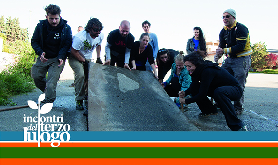
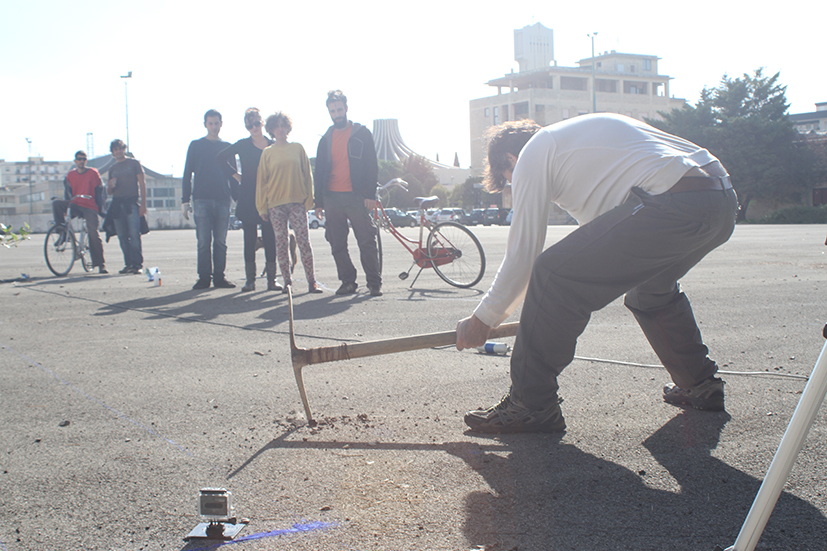
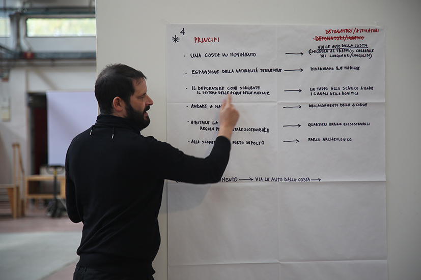
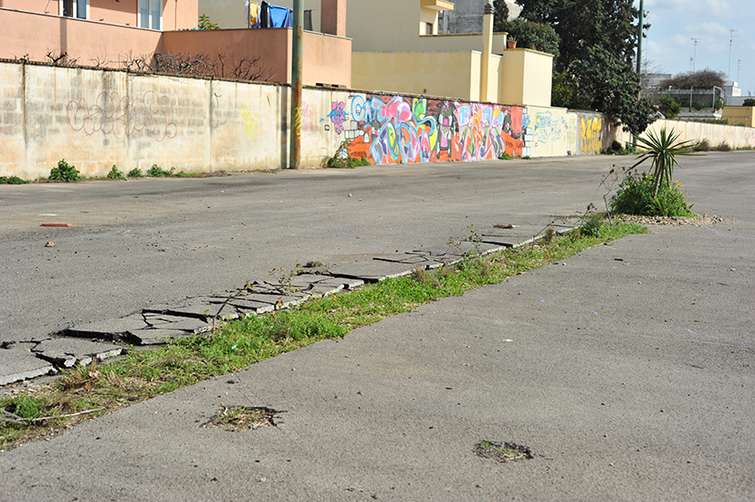

_Dal 5 al 9 novembre 2013_

Da martedì 5 a sabato 9 novembre tornano gli Incontri del terzo luogo e torna Gilles Clément, questa volta accompagnato dai Coloco, paesaggisti argentino/francesi che lavorano al fianco di Gilles in numerosi progetti nel mondo e che si autodefiniscono "Jardiniers pratiquants"!

 

Si tratta del terzo appuntamento di un workshop iniziato nell'autunno del 2012 e proseguito nella primavera del 2013, durante il quale oltre 150 partecipanti hanno cercato di declinare l'idea di "terzo paesaggio" a una dimensione urbana, economica e sociale.

Tre i luoghi scelti: la marina di San Cataldo, in preda all'abbandono e alla confusione urbanistica; le cave di Borgo San Nicola, ormai quasi completamente rinaturalizzate; il grande parcheggio delle Manifatture Knos, oggi un deserto di asfalto.

Dopo una prima immersione nei luoghi, i partecipanti ai due incontri del workshop hanno abbozzato tre progetti, due dei quali (San Cataldo e Knos) sono stati proposti come progetti sperimentali del Piano Urbanistico Generale di Lecce.

Si tratta ancora di sogni che adesso devono confrontarsi con quelle che Gilles Clément chiama "le costrizioni oggettive", al fine di arrivare alla definizione di progetti definiti e chiari, pronti per eventuali realizzazioni sul terreno.

I Coloco si inseriranno direttamente nel progetto del giardino-parcheggio delle Manifatture Knos, ma offriranno la loro esperienza anche agli altri gruppi, per delineare un percorso e degli approdi comuni, pur nella diversità dei luoghi e degli approcci.

Alla fine di questo terzo incontro, i progetti dovrebbero poter essere pronti per la ricerca di finanziamenti utili alla loro realizzazione e saranno oggetto di una pubblicazione, alla quale daranno tutti il loro contributo, compresi i Coloco e Gilles Clément.

In primavera è prevista la fase successiva, con l'inizio delle prime vere e proprie sperimentazioni sul terreno.

Studenti, architetti, giardinieri e curiosi di ogni età hanno preso parte a questa iniziativa ideata e promossa dalle Manifatture Knos, in collaborazione con LUA, ExFadda e Labuat, e patrocinata da Regione Puglia, Comune di Lecce, Lecce 2019 e Provincia di Lecce, che sta coinvolgendo un pubblico sempre più ampio.

Italo Rota, direttore della NABA (Nuova Accademia di Belle Arti) e della Domus Academy di Milano, ci ha invitato per raccontare ai suoi studenti il percorso che abbiamo avviato alle Manifatture Knos con Gilles Clément. Saremo suoi ospiti il 4 novembre. Nel pomeriggio Gilles terrà una conferenza su “Economia e paesaggio” alla Galleria Sozzani.

