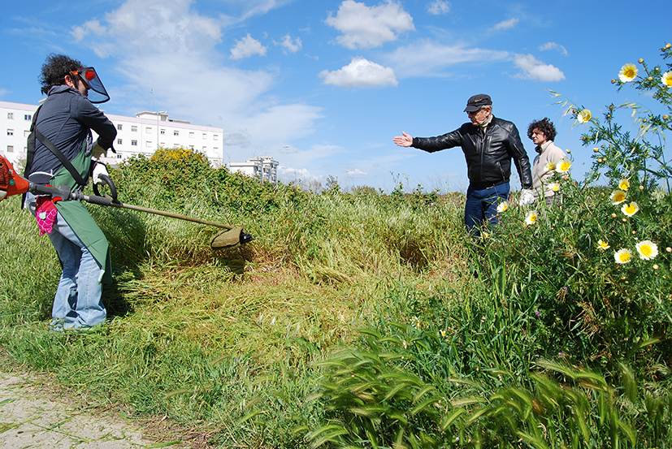

_Dal 9 al 12 aprile 2014_

Ogni giorno, dal 9 al 12 Aprile presso le Manifatture Knos, a partire dalle 10:00 fino a sera, si alterneranno attività laboratoriali, azioni sul campo, incontri pubblici, momenti di riflessione e di convivialità.

Questa edizione avrà un taglio molto più pratico delle precedenti. Insieme ai coordinatori dei gruppi di lavoro abbiamo previsto attività da svolgere sul campo con i partecipanti e gli abitanti dei luoghi interessati dalla sperimentazione delle teorie di Gilles Clément: le marine leccesi; le cave di Borgo San Nicola; il grande parcheggio delle Manifatture Knos.

L'obiettivo è quello di ultimare i progetti definiti nelle precedenti edizioni perché possano far parte del documento programmatico di Rigenerazione Urbana del Comune di Lecce e siano quindi candidabili ai bandi regionali.

Il lavoro pratico sarà accompagnato da momenti di riflessione che si svolgeranno ogni giorno a conclusione delle attività e nella giornata di sabato 12, interamente dedicata al confronto e all'analisi del lavoro svolto e di quello da svolgere. 

Tanti i temi su cui lavorare e gli ospiti di questa nuova edizione. Parleremo di rigenerazione urbana, di mobilità, di etica economica e monete che non si accumulano, di gestione che scompare. Il tutto con la prospettiva del Terzo Paesaggio e del Terzo Luogo.

Gilles Clément sarà presente e guiderà tutte le fasi del workshop con la collaborazione dei Coloco.

 
**ASFALTO MON AMOUR!**

Il gruppo che lavora sul parcheggio delle Manifatture Knos - coordinato da Michele Loiacono (Labuat), Roberto Covolo (ExFadda) e Pablo e Miguel dei Coloco - affronterà tre temi emersi dalle precedenti sessioni: gestione, mobilità e creazione collettiva.
Continueremo a rimuovere porzioni di asfalto e a strappare pezzi di parcheggio per lasciare spazio al giardino che verrà.
Quale equilibrio possiamo raggiungere tra la necessaria (per ora) mobilità automobilistica e la speranza di trasformare il parcheggio in giardino?
Grazie alla collaborazione con alcuni esperti di mobilità, proveremo a realizzare dei dissuasori mobili per impedire alle auto di circolare sul giardino nascente. Proveremo a utilizzare questi dissuasori anche in città, per creare una pista ciclabile temporanea che colleghi le Manifatture Knos, ma più in generale via Vecchia Frigole, al centro di Lecce.
Faremo giardinaggio e lasceremo spazio all'inatteso.

I momenti conviviali e festosi, i pasti e l'ospitalità (pensati per tutti i gruppi di lavoro), saranno occasioni per sperimentare nuovi modelli di gestione, che facciano emergere attraverso diverse forme di relazione risorse ed economie latenti.

Durante il workshop, sarà con noi anche Leonardo Delogu, attore e danzatore che lavora su come integrare la dimensione del corpo con quella del Terzo Paesaggio. Leonardo terrà il workshop "Progettare col corpo: consapevolezza, coabitazione, rito". Un modo originale per rapportarsi allo spazio e ai luoghi.

**CAVE O NON CAVE, UN PARCO SPERIMENTALE**

Il gruppo di Borgo San Nicola - coordinato da Luisella Guerrieri - lavorerà alla realizzazione di un parco cittadino nella zona delle cave. Anche in questo caso ci sembra prezioso coinvolgere gli abitanti del Borgo, tra cui i detenuti della casa circondariale di Lecce.

Gilles Clément condurrà il workshop pratico sul terreno!

**DA SAN CATALDO A FRIGOLE!**

Il lavoro sulle marine leccesi - coordinato dal LUA - questa volta allarga il suo raggio d'azione fino a Frigole, un piccolo villaggio sul mare collegato alla città proprio dalla strada sulla quale si affacciano le Manifatture Knos. Insieme a noi, altre 12 associazioni lavoreranno sul progetto Tra Lecce e il mare c'è di mezzo il fare: laboratorio del Piano di Rigenerazione delle Marine di Lecce.

Il progetto è sostenuto dal Comune di Lecce, Assessorato Pianificazione del Territorio, Urbanistica, Settore Pianificazione e sviluppo del Territorio, e Assessorato Innovazione Tecnologica, Politiche Comunitarie, Politiche Giovanili, Politiche del Lavoro, Formazione Professionale, Settore Programmazione strategica e comunitaria. Finanziato nell'ambito del Programma Operativo FESR - Fondo Europeo per lo Sviluppo Regionale PUGLIA 2007 - 2013, Asse VIII - Linea di intervento 8.1 - Azione 8.1.2 - Sub-Azione 8.1.2 c: "Realizzazione di processi partecipativi via web".

Tra Lecce e il mare c'è di mezzo il fare...

Mercoledì 9 aprile, ore 18-20 - Piazza Sant'Oronzo o Porta Rudiae

Laboratorio del Piano di Rigenerazione delle Marine di Lecce. Iniziativa di coinvolgimento degli abitanti/fruitori delle marine leccesi con l'intento di individuarne i temi emergenti e presentazione e uso di una web app ideata per la promozione, diffusione e gestione del processo all'interno delle comunità locali.

Giovedì 10 aprile, ore 19.30 - Piazza del Borgo di Frigole

Laboratorio del Piano di Rigenerazione delle Marine di Lecce. Cena in piazza finalizzata al coinvolgimento degli abitanti/fruitori della marina leccese e alla presentazione e all'uso della web app.

 

 

**POI LA TEORIA**

**TRUST - UNA GESTIONE CHE SCOMPARE?**

Michele Loiacono di Labuat Taranto, coordinerà un incontro sulla sperimentazione di nuovi modelli economici, quali l'introduzione di una moneta complementare all'euro e di un sistema di credito basato sulla fiducia, con Gilles Clément, Massimo Amato e Luca Fantacci dell'Università Bocconi di Milano, Carlo Mancosu, tra gli ideatori di Sardex, il circuito di credito complementare attivato in Sardegna, Airan Berg, coordinatore artistico di Lecce2019.

**INDECISIONE, AVVERSITÀ, COABITAZIONE**

Incontreremo Leonardo Delogu e Silvia Bottiroli, direttrice di Sant'Arcangelo dei Teatri, festival internazionale di teatro in piazza, per analizzare insieme a Gilles quali sono i Terzi Paesaggi e i Terzi Luoghi teatrali, nella prospettiva di creare una sezione dedicata al teatro di quella scuola del terzo paesaggio che stiamo cercando di costruire.

**POP-UP CYCLE TRACK !**

Cosimo Chiffi di TRT, società di consulenza su trasporti e territorio, ci mostrerà come sperimentare azioni di mobilità sostenibile a Lecce e ne discuteremo insieme a Gilles Clément e i Coloco.

Dopo l'incontro lasceremo spazio alla festa di conclusione dei lavori a cura del Coloco Pablo e di Danilo, architetto urbanista nonché dj d'eccezione che fa girare i suoi dischi dai lontani anni '80 in giro per l'Italia.

 
Gli Incontri del Terzo Luogo sono organizzati dalle Manifatture Knos in collaborazione con:
Lua - Laboratorio Urbano Aperto ǀ Labuat - Laboratorio Urbano d'Architettura Taranto ǀ ExFadda ǀ Bigsur ǀ Ciclofficina Popolare ǀ Scie Urbane ǀ Università Bocconi ǀ Sardex ǀ Festival di Sant'Arcangelo ǀ Lecce2019 ǀ Apulia Film Commission ǀ Comune di Lecce - Assessorato Pianificazione del Territorio, Urbanistica e Assessorato Innovazione Tecnologica ǀ Provincia di Lecce ǀ Regione Puglia

