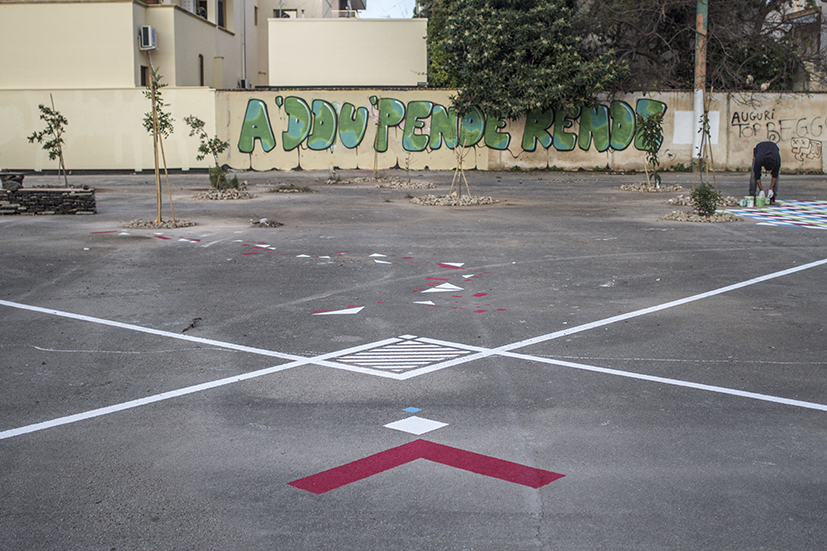

_Dall'11 al 15 novembre 2014 _

Nel corso di questo nuovo appuntamento, previsto dall'11 al 15 novembre, saranno portate avanti le attività del workshop: le azioni sul terreno e il lavoro per il Documento Programmatico sulla rigenerazione urbana relativo ai tre luoghi scelti per la sperimentazione delle teorie di Gilles Clément: le cave di Borgo S. Nicola, le marine leccesi e gli spazi esterni delle Manifatture Knos.

Novità di questi incontri: un nuovo gruppo di lavoro, nato spontaneamente, sul Quartiere Santa Rosa!
Ci sarà anche spazio per laboratori, performance, proiezioni, incontri, escursioni.

Tra i vari, il laboratorio Cinema dell'abitare, organizzato da Giulia Piccione in collaborazione con Paolo Pisanelli, è finalizzato alla realizzazione del film documentario "LA BANDA DEL TERZO LUOGO". Nel reparto MONTAGGIO è prevista la collaborazione di 5 STAGISTI, che potranno seguire gratuitamente un percorso formativo intensivo e partecipare a un'iniziativa di co-produzione culturale volta alla formazione aperta a nutrimento dei talenti di tutte le età. (Le candidature possono essere inviate entro il 9 NOVEMBRE all'indirizzo incontriterzoluogo@gmail.com). Alla fine del laboratorio, alle 15:30 di sabato 15 novembre saranno proiettate le prime immagini del documentario nascente.

Nelle giornate di mercoledì 12 e giovedì 13 alle 19, a conclusione delle sessioni di lavoro, spazio agli incontri pubblici. L'appuntamento di mercoledì è dedicato alla presentazione pubblica del lavoro sul Documento Programmatico per la rigenerazione urbana di Lecce con Gilles Clément, Coloco e coordinatori gruppi. Ospiti della serata saranno Angela Barbanente, Vicepresidente Regione Puglia, Assessore alla Qualità del Territorio, Severo Martini, Assessore Pianificazione e Sviluppo del Territorio, Città di Lecce, Francesca Pace, dirigente Politiche per la mobilità e qualità urbana, Regione Puglia, Luigi Maniglio, dirigente Pianificazione e Sviluppo del Territorio, Città di Lecce.

A seguire Gilles Clément presenterà il suo libro intitolato "Alternativa ambiente".

Nella serata di giovedì incontreremo Thierry Bornand, ricercatore universitario dell'Università di Losanna, che inviterà a riflettere sulla Scuola del terzo paesaggio partendo dal tema "Pedagogia ed emancipazione: qualche esperienza storica".

 
 
 

Da martedì 12 a giovedì 14 a partire dalle 22:45, le serate saranno concluse dal ciclo di proiezioni "Visioni da Abitare" a cura di Giulia Piccione. Nell'ambito del ciclo, mercoledì incontreremo il regista Paolo Pisanelli sul tema "Cinema continuo_visioni del reale".

La festa conclusiva del workshop partirà venerdì pomeriggio alle 18:30 con la performance teatrale nel giardino del Knos "Appunti per una CARmen" a cura di Emanuele Braga. A seguire barbecue e dj set con Danilo Capasso.

 
 
 
 
 

Nella mattinata di sabato 15 novembre sarà possibile prendere parte a una ciclo - escursione alla scoperta del paesaggio attorno a Lecce. Si partirà alle 9 dalla Ciclofficina popolare della Manifatture Knos e si pedalerà in direzione delle marine leccesi, oggetto di futuro rinnovamento urbanistico. Di rientro i partecipanti proveranno a percorrere la "cara" pista ciclabile San Cataldo - Lecce. L'escursione, gratuita e aperta a tutti, è organizzata dalla Ciclofficina Popolare Knos. 

 
 
 
 

Questi Incontri del Terzo Luogo sono organizzati dalle Manifatture Knos in collaborazione con:

Lua – Laboratorio Urbano Aperto ǀ Labuat – Laboratorio Urbano d’Architettura Taranto ǀ Bigsur – Cinema del reale ǀ Ciclofficina Popolare Knos ǀ Santarcangelo •12 •13 •14 Festival Internazionale del Teatro in Piazza ǀ Futurforma | OfficinaVisioni | Apulia Film Commission ǀ Comune di Lecce - Assessorato Pianificazione del Territorio, Urbanistica ǀ Provincia di Lecce ǀ Regione Puglia – Assessorato alla Qualità del Territorio.

