_Dal 19 al 23 maggio 2015_

Cosa accadrebbe se i gestori dei centri culturali europei scomparissero tutti d’un colpo?
Sono anni che lavorano sodo per dimostrare ai loro concittadini che spazi come i loro sono fondamentali. E così organizzano, organizzano, organizzano. L’organizzazione è diventato il loro mestiere. 
E se andassero tutti in vacanza nel Sud Italia per un lungo periodo? Cosa accadrebbe ai loro centri? Il management deve essere onnipresente, oppure può dirsi compiuto quando non si rende più necessario? Organizzare significa pianificare tutto per non lasciare spazio all’imprevisto, oppure creare le condizioni migliori affinché qualcosa di inatteso possa avere luogo? E se bastasse una minima cura per lasciare spazio alla spontaneità, senza che questa si trasformi in caos?

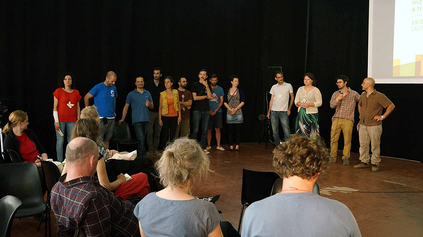
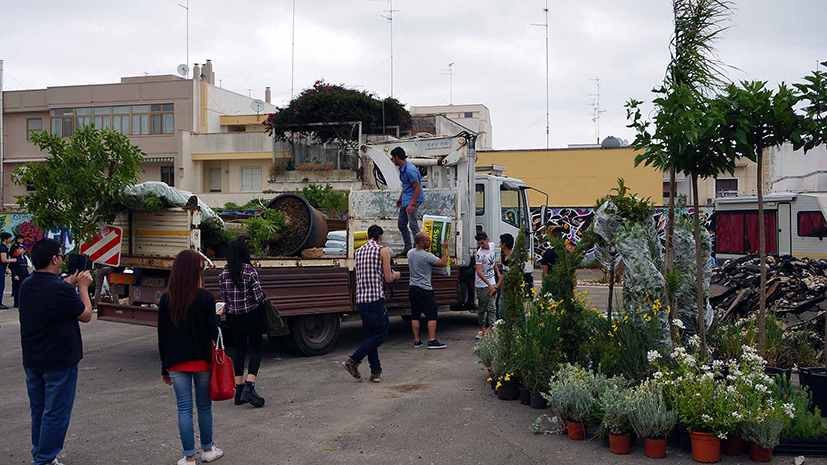
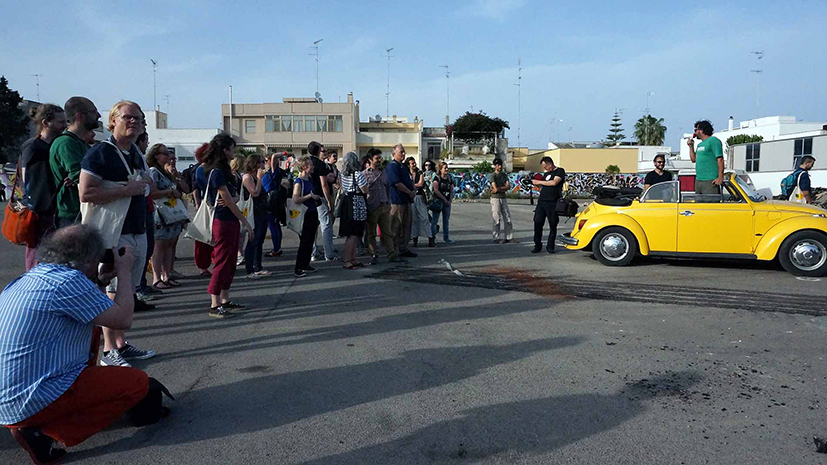
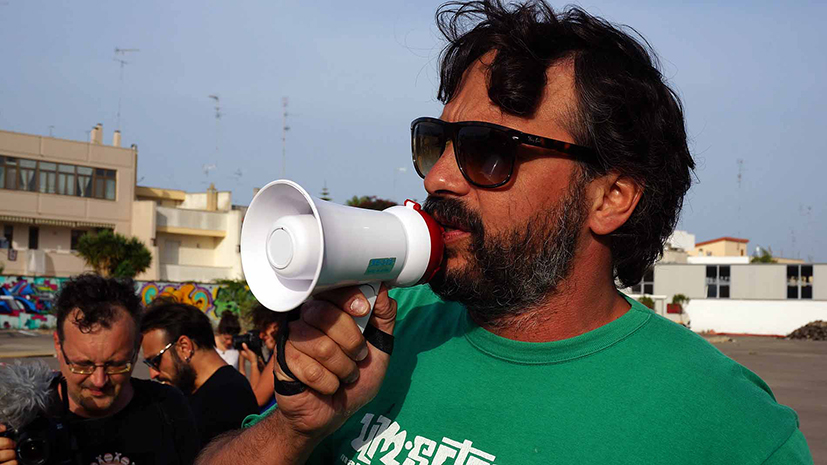

È possibile immaginare degli spazi che chiunque può usare e trasformare liberamente senza che la legge del più forte si imponga? È possibile pensare che uno spazio sia comune proprio per questo? Come si fa a dare dignità politica all’indecisione?

Con la sua teoria sul “terzo paesaggio”, il famoso giardiniere Gilles Clément sostiene che gli spazi solitamente considerati come residuali siano aree privilegiate per l’accoglienza della diversità e luoghi dell’invenzione biologica. Sono i bordi delle strade, le fabbriche o le cave abbandonate, gli spazi che sfuggono. Insieme a lui, le Manifatture Knos hanno iniziato da un paio di anni a interrogarsi su quali potrebbero essere i “terzi luoghi”, non più cioè solo spazi abbandonati dall’uomo, ma luoghi abitati. Gli Incontri del terzo luogo sono nati per iniziare questa ricerca con workshop pratici di trasformazione diretta di alcuni spazi della città con lo scopo di aprire spazi di indecisione.

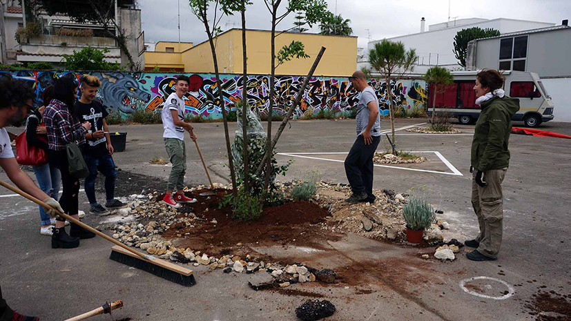
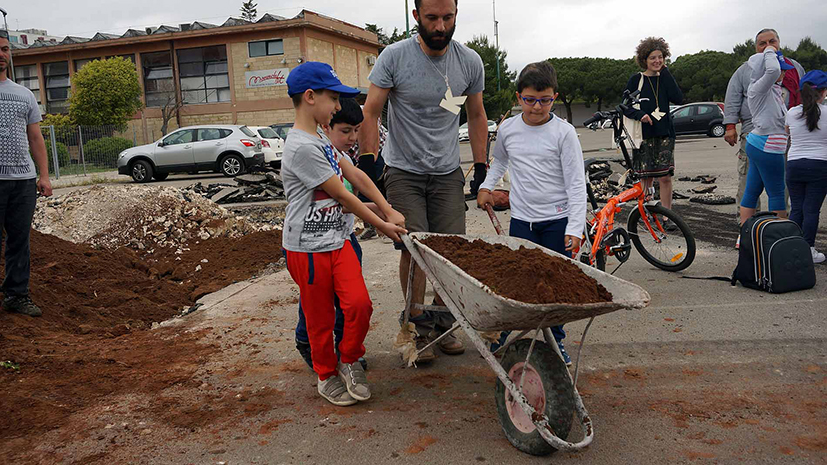
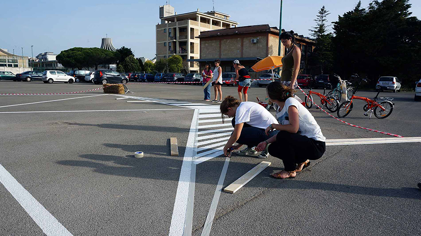
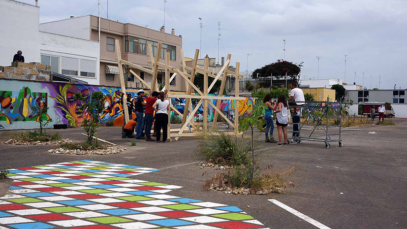

Le Manifatture Knos e Trans Europe Halles invitano tutti a prendere parte a questa esperienza e a darle nuova linfa.

Il 19 e il 20 maggio prenderanno il via gli Incontri del Terzo Luogo con tre workshop su tre luoghi della città, che dureranno fino al 23 maggio. I tre workshop ospiteranno il 79° meeting di Trans Europe Halles, che inizierà giovedì 21 maggio con una conferenza pubblica di Gilles Clément e finirà domenica 24 Maggio.
Gli Incontri del terzo luogo e il Meeting di Trans Europe Halles sono aperti a tutti, compresi i bambini!

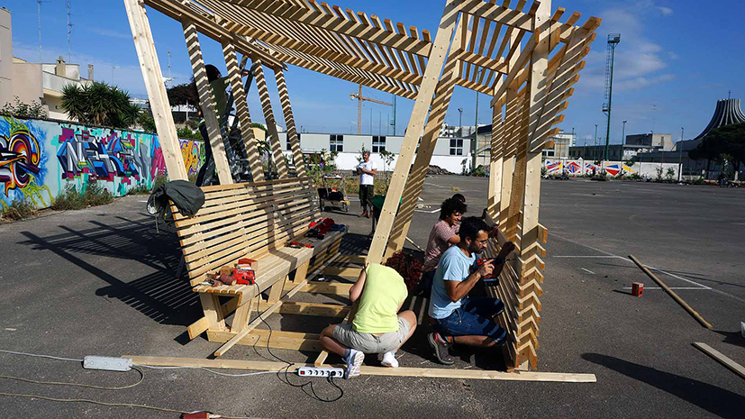
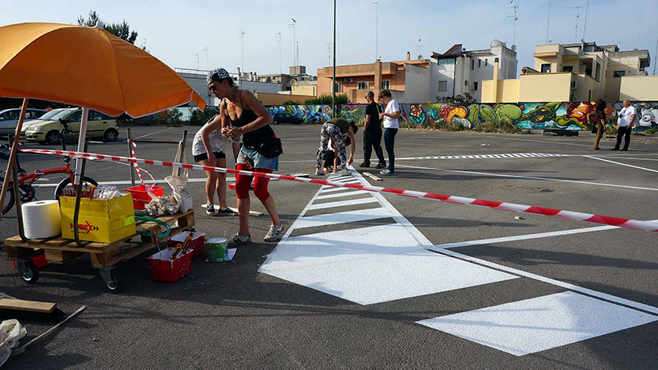
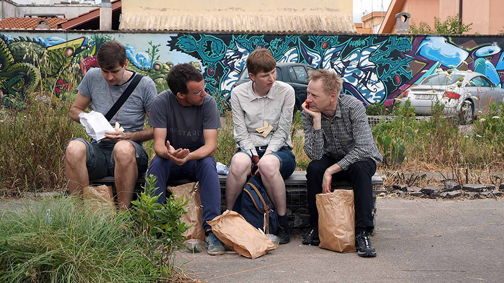
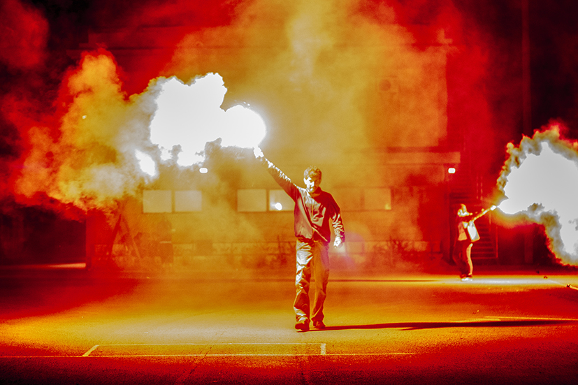
[plugin:youtube](https://youtu.be/VnRdp9kMvDo)
