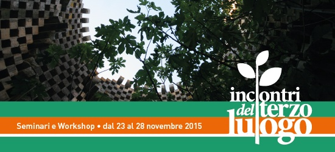

Dal 23 al 28 novembre 2015

È tutto pronto per una nuova edizione degli Incontri del Terzo Luogo, al cui interno prenderà il via la SCUOLA DELL'INDECISIONE.

YONA FRIEDMAN guida una nuova sperimentazione al Knos per un'architettura senza architetti! Il nostro nuovo ospite, PHILIPPE RIZZOTTI, ci aiuterà in questa direzione con un workshop pratico e pieno di sorprese. Prosegue il percorso orientato da Gilles Clément, sul giardino di asfalto con i Coloco, e a Borgo San Nicola con gli abitanti del piccolo villaggio.

Tre i workshop pratici preceduti da un seminario di due giorni tenuto da Antoine Aubinais di Bellastock su nuove modalità costruttive. 

ASFALTO MON AMOUR con Pablo Georgieff e Michele Loiacono

Manifatture Knos - 24/27 novembre

Una spianata d'asfalto si sta trasformando in un giardino in movimento ispirato alle teorie di Gilles Clément. Il giardino avanza durante ogni appuntamento con gli incontri del Terzo Luogo. Anche in questa edizione il avrà modo di crescere e di arricchirsi di arredi e decori in grado di renderlo più vivibile e accogliente.

 

IL MUSEO DELL'ALBERO con Philippe Rizzotti, Roberto Dell'Orco, Rossella Tricarico, Mariangela Bruno

Manifatture Knos - 24/28 novembre

Uno stradone alberato da trasformare in museo dell'improvvisazione architettonica. Un'attività pratica di allestimento e costruzione ispirata alle teorie di uno dei luminari dell'architettura del Novecento: Yona Friedman.

 

LE CAVE E LE CASE DI BORGO SAN NICOLA con Luisella Guerrieri, Laura Basco, Caterina Quarta e Afro Carpentieri - Con la partecipazione di Stéphane Block e Louis Schild

Manifatture Knos/Borgo San Nicola - 24/28 novembre

Periferia urbana, archeologia industriale, case popolari e terzo paesaggio s'incontrano in uno spazio urbano da rendere fruibile e restituire alla collettività grazie ai suggerimenti e all'ispirazione di Gilles Clément.

 

Il pomeriggio di venerdì 27 novembre sarà interamente dedicato agli eventi conclusivi dei workshop, durante i quali di rifletterà insieme sul senso delle sperimentazioni pratiche condivise, in particolare attorno ai temi della progettazione paesaggistica e delle sue regolamentazioni a livello regionale, e dell’architettura sostenibile.

 

In conclusione delle attività, venerdì 27 a partire dalle 22, tutti sono invitati a partecipare al Rainbow Friday, una cinefesta con dj set e performance teatrali, organizzata dall’associazione LeA – Libermente e Apertamente, per celebrare la bellezza della diversità e auto-finanziare il Rainbow Festival.

 

All’interno degli Incontri si colloca sabato pomeriggio il “Forum sulle economie”, per provare a immaginare associazioni, imprese, professionisti e lavoratori che scambiano tra loro beni e servizi senza ricorrere alla moneta delle banche.

 

Gli Incontri del Terzo Luogo sono preceduti dal seminario che Antoine Aubinais, fondatore di Bellastock, terrà presso l’Istituto Calasanzio di Campi Sentina il 23 e il 24 novembre dalle 8.30 alle 14.30.

 

Questa edizione degli Incontri del Terzo Luogo rappresenta la parte pratica di un più ampio percorso di formazione su "Monitoraggio e Gestione Sostenibile del Territorio, dell'Ambiente e del Paesaggio" (Avviso n. 7/2015, PO Puglia FSE 2007-2013, Asse VII - Capacità Istituzionale, Corsi di formazione Assetto del Territorio), che si terrà presso l'Istituto Calasanzio di Campi Salentina a partire dall'11 novembre. Per maggiori informazioni: http://www.calasanziofp.it/
