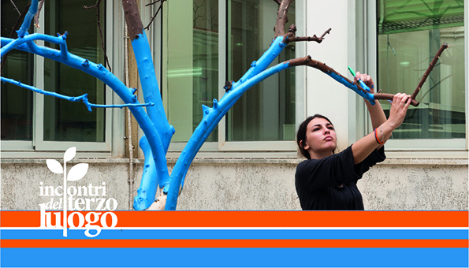

Dall'11 al 14 maggio 2016

Gli Spazi di Indecisione sono quei luoghi in cui l’assenza di una totale programmazione lascia spazio all’invenzione e alla spontaneità. Nel corso dei tre anni di Incontri del Terzo Luogo abbiamo intrapreso un percorso, all’interno di questi spazi, che ci ha permesso di operare attraverso momenti di incontro, di scambio, di confronto, di azione e di attesa. La ciclicità di questi momenti ha fatto sì che un gruppo di partecipanti agli Incontri del Terzo Luogo potesse dare continuità al percorso, intensificando i momenti di confronto e aprendo la strada a nuove possibilità di intervento.

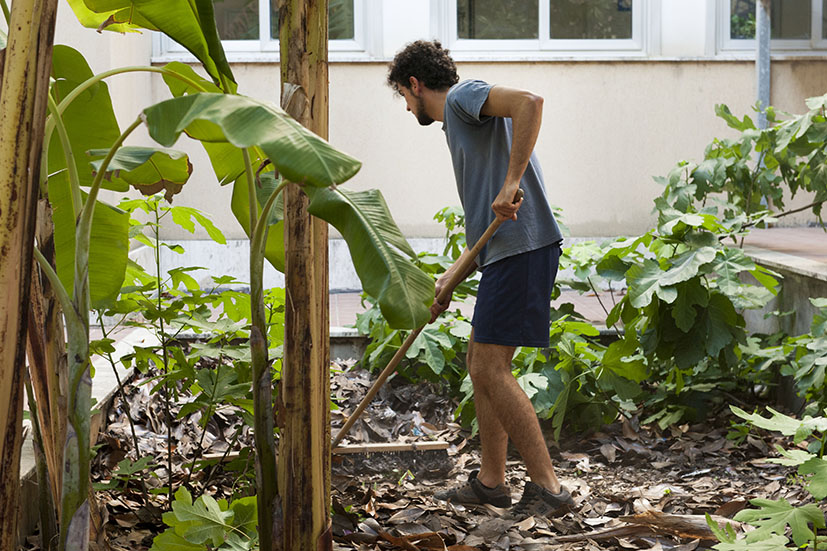

Da questa esperienza nasce la Scuola dell’Indecisione, una scuola informale, libera e aperta, che non ha insegnanti nè studenti, dove l’esperienza collettiva diventa fondamentale per poter imparare. Un luogo nel quale si possa discutere del concetto stesso di scuola.  Più che un luogo è un tempo in cui ci si confronta con la quotidianità, in cui si cercano soluzioni e in cui si aspetta di capire come le piccole azioni umane possano evolvere in sinergia con i luoghi in cui avvengono. La Scuola dell’indecisione è la pratica attraverso cui vogliamo prenderci cura di questi spazi.

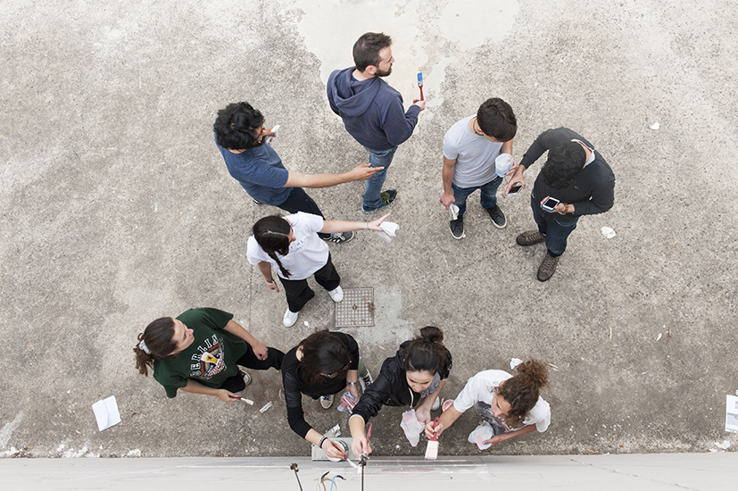
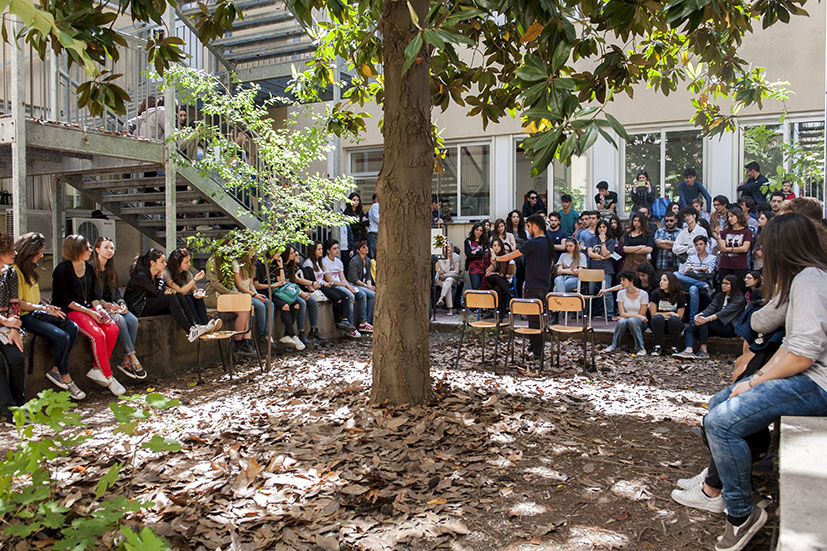

Cosa succede se un collettivo di studenti di una scuola istituzionale inizia a frequentare le Manifatture Knos e a vivere questo spazio in modo più autonomo e informale rispetto alla quotidianità vissuta nella propria scuola?

Prendendo coscienza degli spazi e delle possibilità d’uso i ragazzi del collettivo Avanti Banzi hanno iniziato a sviluppare l’idea di poter rigenerare gli spazi della propria scuola, cercando riferimenti da seguire sia nelle persone che identificano come guide sia nelle esperienze con cui sono entrati in contatto.

Ne è nata l’idea di poter utilizzare la Giornata dell’Arte del 14 maggio non esclusivamente come libera espressione del proprio estro bensì come momento fondamentale per ripensare il tempo dentro la scuola, attraverso azioni collettive di Ri-creazione che definiscono una graduale riappropriazione degli spazi da parte dell’intera comunità scolastica.

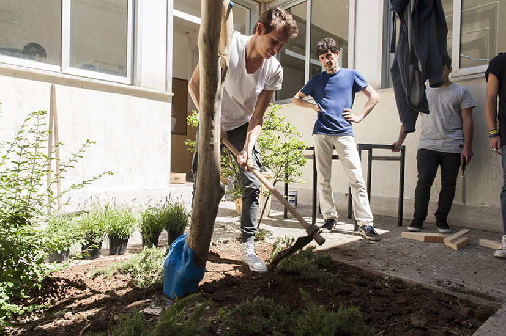
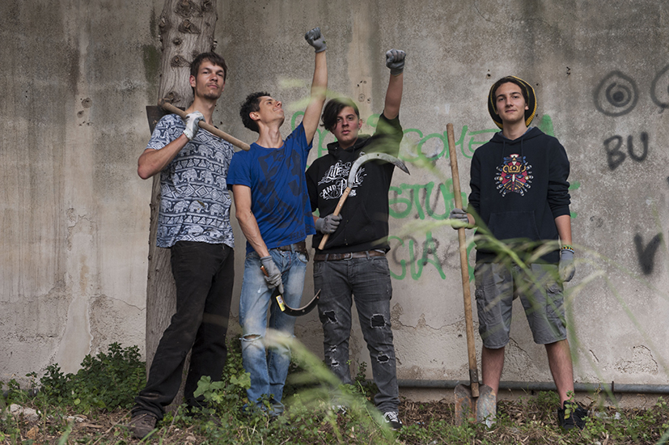
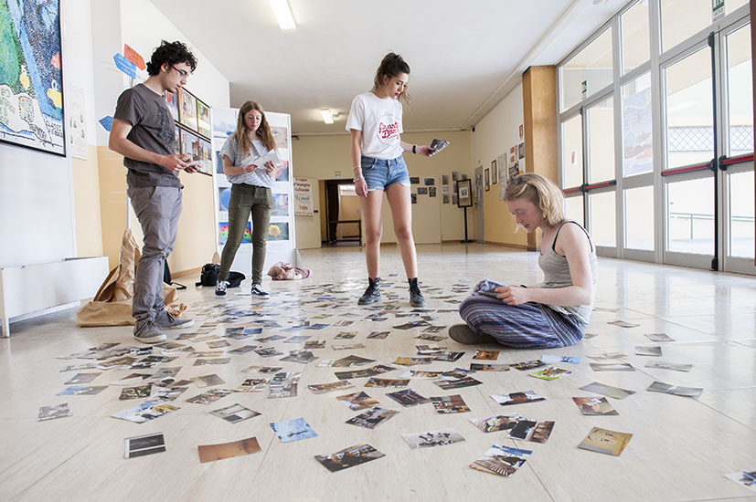
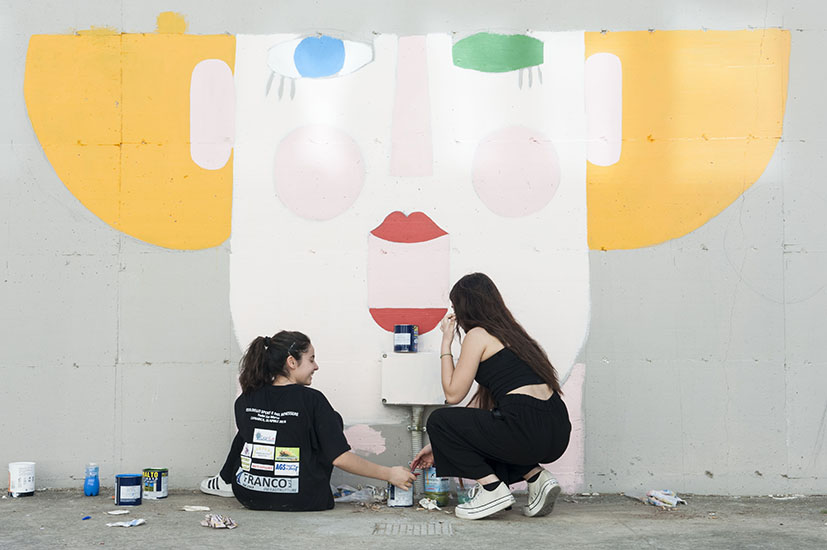

La Scuola dell’Indecisione si inserisce in questo percorso condividendo con i ragazzi attrezzi e pensieri. Vogliamo aprire questo importante momento di formazione a tutti coloro che liberamente sono interessati a prenderne parte e in particolare a chi ha già condiviso con noi le precedenti esperienze degli incontri del Terzo Luogo. Dall’11 al 13 maggio affiancheremo i ragazzi, “preparando il terreno” per tutti gli interventi di rigenerazione nelle aree già individuate e il 14 maggio la sessione di lavori si chiuderà con una grande festa.

Nelle scorse settimane, dopo diversi sopralluoghi, il collettivo ha individuato alcuni spazi esterni del Liceo Banzi sui quali intervenire, immaginando nuove identità e nuovi modi per abitarli, trasformandoli da luoghi abbandonati in spazi fruibili dalla comunità scolastica. Ne sono nati cinque laboratori coordinati da BigSur, Manifatture Knos e Scuola dell’Indecisione ai quali tutti, studenti e cittadini, potranno partecipare.

L’illustratore Pierpaolo Gaballo guiderà un workshop di street art e graffiti per decorare le pareti di un seminterrato scoperto. L’architetto Mariangela Bruno terrà un laboratorio di autocostruzione di arredi per esterni. La designer Rossella Tricarico coordinerà gli interventi espressivi e artistici collettivi ispirati alla presenza degli alberi. Alcuni studenti, con la guida della fotografa Martina Leo, si occuperanno dello storytelling fotografico dell’evento. Coordina i vari interventi Francesco Maggiore di BigSur, che si dedicherà in particolar modo al decoro e all’allestimento di uno dei cortili interni della scuola.

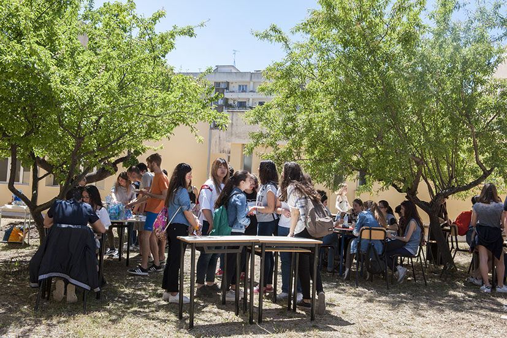
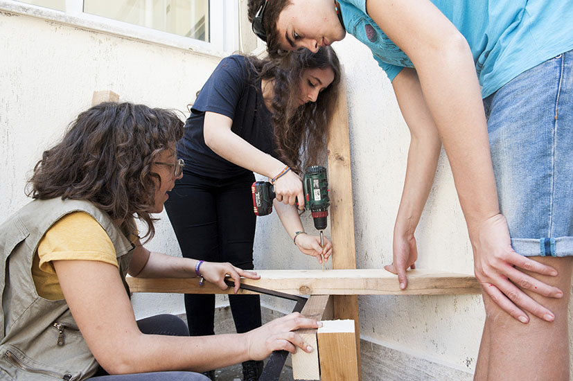
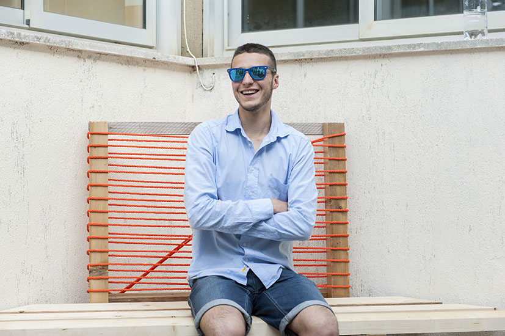

Le Manifatture Knos accoglieranno e coordineranno la partecipazione di tutti i cittadini interessati a questo processo di riappropriazione degli spazi comuni. L’appuntamento è per mercoledì 11 maggio alle ore 13 presso le Manifatture Knos, dove i partecipanti saranno accolti da un pranzo di benvenuto. A seguire la Ciclofficina popolare del Knos metterà a disposizione le bici per raggiungere il Liceo Banzi dove dall’11 al 13 maggio si svolgeranno le attività preparatorie per la giornata conclusiva del 14: BanzART!

Sabato 14 a partire dalle 8:30 prenderà il via la Giornata dell’Arte che vedrà concludersi il percorso di Ri-creazione degli spazi scolastici. Il programma della manifestazione prevede momenti di musica, arte e convivialità con esibizioni musicali, live painting di graffiti, pranzo in collaborazione con il Gruppo di Acquisto Solidale di Lecce, interventi artistici dell'Associazione LeA - Liberamente e Apertamente, Dj Set e Jam Session, fotografia, scrittura e teatro. A conclusione della giornata i concerti di Bandadriatica e Cesko degli Après La Classe.

Questa giornata non vuole essere un punto di arrivo ma la tappa iniziale di un percorso, all’interno di uno spazio istituzionale, che ha l’obiettivo di creare nuove occasioni di indecisione, di invenzione e di spontaneità.

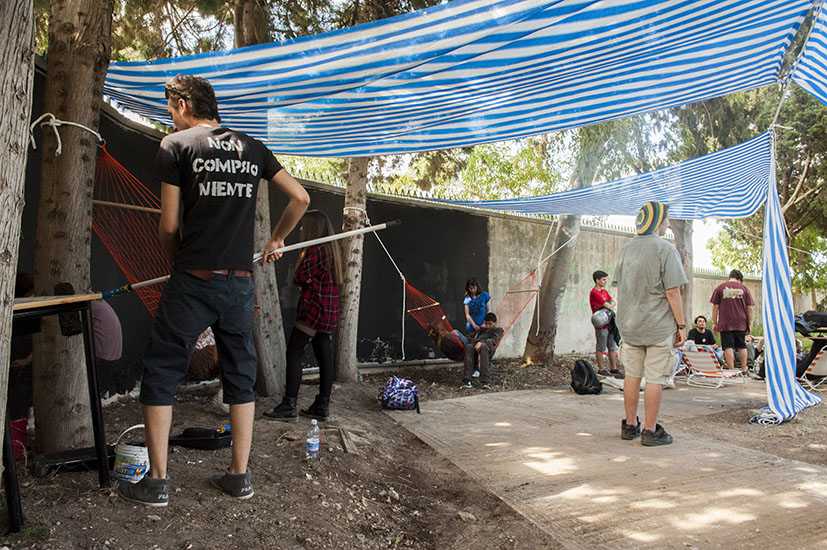

Le attività della Scuola dell’Indecisione sono realizzate nell’ambito di “Creative Lenses: Business Models for Culture” progetto europeo sui modelli di sostenibilità economica dei centri culturali, di cui le Manifatture Knos sono partner insieme a: Trans Europe Halles (TEH); IETM – network for contemporary performing arts; centro culturale Vyrsodepseio (Atene); centro culturale Stanica (Zilina, Slovacchia); centro culturale P60 (Amstelveen, Olanda); centro culturale Village Underground (Londra);  University of the Arts of London; Università della Basilicata (Matera); città di Lund (Svezia); Olivearte (UK); Creative Industry of Kosice (Slovacchia).
