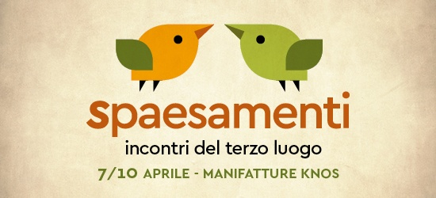

Dal 7 al 10 aprile 2017

Sei giorni di attività, workshop, conferenze per segnare un passaggio: ci eravamo lasciati indecisi e ci ritroviamo spaesati..

Ma è uno spaesamento ricco e fecondo, che, a ben vedere, ha a che fare con un atto rivoluzionario, perché rivoluzionare non vuol dire necessariamente trasformare per far diventare altro. Ma forse, più semplicemente, cambiare il proprio sguardo su ciò che ci circonda. D’un tratto, non sentirsi più a casa propria.

Tale spaesamento non deriva solo dall’arrivare in un luogo sconosciuto o inaudito. Ci si può spaesare senza andare via, restando presso di sé, perdendo i riferimenti usuali. Come quando appare qualcosa proprio lì dove c’era da sempre qualcos’altro. Come quando una musica o un quadro ci trasportano altrove. Come quando una poesia, da sola in un cassetto, istituisce un mondo nuovo.

Tra i tanti ospiti, saranno con noi:

Il paesaggista e giardiniere Gilles Clément / L'architetto, urbanista e docente Angela Barbanente / L'architetto e territorialista Alberto Magnaghi / I filosofi François Fédier e Alexandre Schild / Il regista Michelangelo Frammartino / L'architetto e scenografo Patrick Bouchain / Il collettivo di architetti e paesaggisti Paysagistes Sans Frontières / I musicisti Stéphane Blok e Louis Schild.

 

/// Micro-interventi ///

Picconare il pavimento del Knos per piantarci un mandarino, montare all’interno una grande altalena, aprire un varco nel muro di cinta per creare un dialogo con il vicinato, accogliere le piante nel bar, esplorare lo spazio con il movimento del proprio corpo, sviluppare un’incursione sonora: queste sono alcune delle proposte già raccolte.

Ce ne aspettiamo molte altre per mutare lo sguardo su ciò che ci circonda, per lasciarci spaesare da ciò che vedremo accadere.

Ciascuno può unirsi liberamente agli interventi degli altri o proporne di nuovi, nella completa autogestione.

A disposizione: un banco degli attrezzi da falegnameria e da giardinaggio, piani di lavoro sparsi nell’open space, tutto ciò che ciascuno vorrà portare e condividere con gli altri.

I luoghi di intervento: 4000 mq al coperto (le Manifatture Knos), 10000 all’aperto (l’ex parcheggio adiacente le Manifatture Knos), una cava dismessa (a Borgo San Nicola).

Luoghi che possono diventare con le nostre azioni sempre più accoglienti a ogni forma di diversità umana, animale o vegetale.

Tutti avranno modo di confrontarsi sul senso di tali interventi con Gilles Clément, Paysagistes sans frontières, François Fédier, Alberto Magnaghi, Angela Barbanente, Massimo Amato, Alexandre Schild, la comunità del Terzo Luogo e gli abitanti del Knos.

 

/// Manifesto ///

Perché le Manifatture Knos? Spontaneità, indecisione, spaesamento.

Sono passati ormai quasi dieci anni da quando le Manifatture Knos hanno riaperto i battenti per diventare un luogo accogliente in cui ogni giorno transitano, operano, vivono, sperimentano diverse comunità di persone che condividono interessi, passioni, sogni.

Sono passati ormai quasi cinque anni da quando gli Incontri del Terzo Luogo sono diventati parte integrante di un percorso di riflessione e di crescita sulla città e sui suoi spazi di indecisione.

È giunto il momento di tirare le somme e di scrivere nero su bianco quei messaggi di cui la comunità knossiana vuole farsi portavoce insieme a voi.

Come si possono sovvertire civilmente quelle regole che limitano la crescita di una comunità? In che modo si agevolano i processi spontanei senza che diventino dannosi per gli altri? Cosa vuol dire dare dignità politica all’indecisione? Cos’è che ci fa cambiare lo sguardo su ciò che ci circonda?

E cosa vuol dire gestire un bene comune? Come ci si autogestisce all’interno di uno spazio condiviso? Come si sostiene economicamente un centro culturale che vuole essere indipendente? Come si accolgono le tante proposte quotidiane? Come si incentiva la partecipazione delle nuove generazioni? In che modo i processi che si innescano all’interno di un centro culturale possono diventare pedagogici?

A partire da una serie di quesiti vogliamo discutere con voi le tematiche che le Manifatture Knos affrontano quotidianamente, con l’obiettivo di tracciare un percorso di indagine valido anche per altri contesti.

Le idee raccolte nel Manifesto saranno un modo per ripensare e comunicare il senso di quello che facciamo e saranno veicolate in Europa tramite il progetto Creative Lenses di cui le Manifatture Knos sono partner fondativo. Un progetto che vede il coinvolgimento di numerosi centri culturali europei e che mira alla definizione di nuove forme di gestione del bene comune.

Nella redazione finale del manifesto ci aiuteranno Gilles Clément, Alberto Magnaghi, François Fédier, Michelangelo Frammartino, Angela Barbanente, Alexandre Schild, Paysagistes Sans Frontières, Massimo Amato.

 

/// Progettare la Scuola dell’Indecisione ///

Nel corso delle precedenti edizioni degli Incontri del Terzo Luogo abbiamo intrapreso un percorso negli spazi dell’Indecisione che ci ha permesso di operare attraverso momenti di incontro, di scambio, di confronto, di azione e di attesa.

La ciclicità di questi momenti ha fatto sì che un gruppo di partecipanti agli Incontri del Terzo Luogo potesse dare continuità al percorso, intensificando i momenti di confronto e aprendo la strada a nuove possibilità di intervento.

Da questa esperienza nasce la Scuola dell’Indecisione, una scuola informale, libera e aperta, che non ha insegnanti né studenti, dove l’esperienza collettiva diventa fondamentale per poter imparare. Un luogo nel quale si possa discutere del concetto stesso di scuola. Più che un luogo è un tempo in cui ci si confronta con la quotidianità, in cui si cercano soluzioni e in cui si aspetta di capire come le piccole azioni umane possano evolvere in sinergia con i luoghi in cui avvengono. La Scuola dell’indecisione è la pratica attraverso cui vogliamo prenderci cura di questi spazi.

Il progetto della scuola è ancora in fieri e la sua prima sperimentazione partirà durante la prossima estate, come parte integrante del Catalyst Programme del progetto Creative Lenses.

In questa edizione degli Incontri vogliamo confrontarci sul tema della scuola con Patrick Bouchain, iniziatore dell’Université Foraine, un luogo di trasmissione dei saperi effimero, nomade, che agisce su luoghi inoccupati, senza programma definito e che attraverso la festa genera partecipazione e libero apprendimento.

La scuola dell’indecisione vuole sperimentare nuove forme di pedagogia ridiscutendo i modelli di insegnamento convenzionali e intende dare dignità politica all’indecisione come modalità di intervento sul bene comune.

Le attività della Scuola dell’Indecisione sono realizzate nell’ambito di Creative Lenses: Business Models for Culture progetto europeo sui modelli di sostenibilità economica dei centri culturali, di cui le Manifatture Knos sono partner insieme a: Trans Europe Halles (TEH); IETM – network for contemporary performing arts; centro culturale Vyrsodepseio (Atene); centro culturale Stanica (Zilina, Slovacchia); centro culturale P60 (Amstelveen, Olanda); centro culturale Village Underground (Londra); University of the Arts of London; Università della Basilicata (Matera); città di Lund (Svezia); Olivearte (UK); Creative Industry of Kosice (Slovacchia).

 

/// Il Cinema del Terzo Luogo ///

Dalla collaborazione con l’Apulia Film Commission nasce una nuova rassegna cinematografica sul paesaggio e le sue possibili declinazioni. Questa prima edizione del Cinema del Terzo luogo coinvolge tre autori del panorama cinematografico contemporaneo italiano che negli anni hanno affrontato il tema con un approccio che si colloca a metà tra film e documentario. Il programma prevede la proiezione de Le quattro volte (2010), di Michelangelo Frammartino, nella serata di domenica 9 aprile, de I cormorani (2016), di Fabio Bobbio, e del cortometraggio Con il vento (2016), di Claudio Romano, nella serata di lunedì 10 aprile. Le proiezioni verranno introdotte dal critico Luigi Abiusi che si confronterà di volta in volta con i registi e il pubblico presenti in sala.
Tutte le proiezioni della rassegna si terranno nel CINELAB, la nuova sala del Cineporto dedicata a Giuseppe Bertolucci.
Inoltre, nella serata di lunedì 10 aprile, il Cinema del Terzo Luogo accoglierà gli studenti del Cineclub Universitario, guidati dal professor Bandirali.
