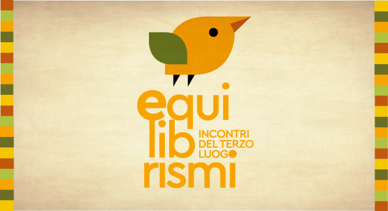

Dal 30 novembre al 3 dicembre 2017

E se tutto si giocasse sul filo di un rasoio?
Se tirare la corda fosse l’occasione per una nuova funambolica prospettiva, i due pesi trovassero finalmente le loro due misure e le norme non obbligassero a essere normali?

Conciliare interessi contrapposti non implica necessariamente moderazione e compromesso. Ogni volta è questione di bilanciamento. Non per livellare, ma per tenere conto delle differenze, salvaguardandole. Come quando si prova a ripensare insieme cura e abbandono, vicinato e rappresentazione, spontaneità e regole, amicizia e scarsità. Come quando si allargano le braccia per trovare l’equilibrio.

Il programma sarà arricchito dall'inaugurazione di tre mostre: "Cinque anni di Terzo Luogo" e "Arte involontaria" e "Gli imprevedibili" di Gilles Clément.

Dal 30 Novembre al 4 Dicembre vi aspettiamo alle Manifatture Knos per trascorrere con noi qualche giorno all'insegna del 'funambolismo'!

TAVOLI DI LAVORO

Dopo cinque anni di Incontri del terzo luogo, alcuni nodi vengono al pettine.

Equilibri di vicinato
con Gilles Clément, Rosario Gatto e William Owino

Una corda tesa in un giardino di ingresso: la necessità di rappresentanza di un ente pubblico e l’attività indecisa di un centro culturale. Un possibile equilibrista: William, il nuovo giardiniere.

Una corda tesa in una cava abbandonata: i desideri degli abitanti e i progetti mai realizzati dalle diverse amministrazioni pubbliche. Un possibile equilibrista: Rosario, il professore del Borgo.

Strutture da bilico
con Mariangela Bruno e Public Works

Costruzioni improbabili, strutture da brivido.
Non sempre rispettano le leggi della fisica e degli uomini.
Alla ricerca di equilibri possibili, del limite tra staticità e movimento fino al punto di non ritorno.

Cucina aperta
con Naked e Bellastock

Nutrire pur usando mezzi di fortuna e lasciando aperta la cucina.
Preservare la convivialità dallo spreco di risorse.
Una cucina che diventa un laboratorio aperto alla partecipazione di tutti.

UN NUOVO SOGNO

L’ex Galateo
con Patrick Bouchain, Loredana Capone (Ass. Industria turistica e culturale, Gestione e valorizzazione dei beni culturali della Regione Puglia) e Rita Miglietta (Ass. all’Urbanistica del Comune di Lecce)

Un immenso stabile abbandonato in un parco inaccessibile nel pieno della città.
Il difficile equilibrio tra recupero, scarsità di risorse, necessità di case e spazi, desiderio di partecipazione.
Una passeggiata tutti insieme per immaginare un cammino.

MOSTRE

Arte Involontaria
Scatti fotografici di Gilles Clément. Il felice risultato di una combinazione imprevista di situazioni o oggetti organizzati tra loro secondo regole d'armonia dettate dal caso.

Gli imprevedibili
Uno sberleffo affettuoso alla società umana disegnata da Gilles Clément durante noiose riunioni di lavoro.

Cinque anni di Terzo Luogo
Un racconto per immagini e oggetti del percorso del Terzo Luogo, giunto al suo quinto anno.
Immagini di Maurizio Buttazzo e di storici partecipanti agli Incontri del Terzo Luogo.

CINEMA

Il Cinema del Terzo Luogo
Seconda edizione per il Cinema del Terzo Luogo, con la partecipazione straordinaria di Franco Piavoli, che introdurrà la proiezione de ‘Il pianeta azzurro’, e il ritorno di Michelangelo Frammartino e Luigi Abiusi per introdurre ‘Lungo il fiume’ di Ermanno Olmi.
Frammartino ci guiderà inoltre dallo spaesamento all’equilibrio dello sguardo in un incontro didattico aperto a tutti.

MOVIMENTI

La danza delle api
Un progetto a metà tra una performance collettiva e una festa ispirato al processo decisionale delle api applicato alle decisioni di gruppi umani. Accompagnano le selezioni di Mimmo Pesare e Mino Degli Atti nel loro Krill dj set. La danza delle api è la sperimentazione della danza come alternativa al solo linguaggio verbale nei processi decisionali.

La scuola dell’equilibrio delle Manifatture Knos
Le giornate degli Incontri si apriranno con momenti dedicati all’equilibrio fisico e mentale a cura di Sabino Tamborra del laboratorio di Zen Stretching e di Barbara Mangiacavalli del laboratorio di Yoga, entrambi della Scuola dell’Equilibrio del Knos che comprende numerose discipline dall’arrampicata al tessuto aereo, dall’acrobalance allo zen stretching, dallo yoga al tango.

OSPITI

Patrick Bouchain
Figura di riferimento dell’architettura europea, con particolare attenzione all’autorecupero, Patrick Bouchain è pioniere della trasformazione di spazi industriali abbandonati in luoghi culturali e grande mediatore tra cittadini e amministrazioni locali. Oltre alla visita nell’ex Galateo alla ricerca di ciò che potrebbe accadervi, con lui discuteremo di pedagogia e di Scuola dell’indecisione: insieme all’attuale Ministro della cultura francese, Bouchain è iniziatore di una frequentatissima scuola sperimentale.

Gilles Clément
Gilles segue il processo degli Incontri del Terzo Luogo sin dalla prima edizione e le sue teorie hanno ispirato i vari processi generati dagli Incontri. Giardiniere, filosofo, botanico, entomologo e scrittore. Il suo principio del “giardino in movimento” si basa sulla filosofia del “fare il più possibile con, il meno possibile contro”, con l’obiettivo di trarre beneficio dalla diversità senza distruggerla. Questa volta sarà con noi non solo per prendere parte agli Incontri ma anche per presentare due mostre di suoi disegni e fotografie.

Franco Piavoli
Regista italiano e autoproduttore delle sue opere. Dopo aver esercitato per alcuni anni la professione di avvocato abbandona il campo per dedicarsi al lavoro di documentarista. Il Pianeta Azzurro è il suo lungometraggio d’esordio che lo ha messo in luce nell’edizione dell’82 del Festival del Cinema di Venezia. Grazie alla cinepresa di Silvano Agosti, Piavoli lavorò per un anno e in assoluta solitudine alle riprese di quello che Andrej Tarkovskij definirà un capolavoro. Sarà con noi per raccontarcelo durante l’appuntamento serale con il Cinema del Terzo Luogo.

Michelangelo Frammartino
Autore di “Le quattro volte” e “Alberi” e già ospite della prima rassegna dedicata al Cinema del Terzo Luogo dedicata agli ‘spaesamenti’, tornerà in questa seconda edizione per partecipare attivamente alla discussione con una riflessione cinematografica che nasce dallo spaesamento e arriva a trovare la sua forma di equilibrio.

Massimo Amato
Dopo i numerosi momenti di confronto sulle monete complementari, torna l’autore di “L’enigma della moneta” per parlarci di equilibrio economico a partire dalle architetture di Alexander Calder. Apriremo questi nuovi Incontri con le sue parole.

Public Works 
Piattaforma di architettura con base a Londra, opera in diversi contesti urbani della città a diretto contatto con i suoi abitanti e i precari equilibri della vita di quartiere. Recupero di materiali, autocostruzione e mediazione sono le loro parole chiave. Hanno avviato di recente la ‘Civic University’, un progetto di scuola diffuso nello spazio urbano.

Bellastock/Discosoupe
Collettivo francese che si occupa di architettura sperimentale partecipa per la seconda volta agli Incontri del Terzo Luogo, questa volta con Simon Jacquemin. Durante il festival di architettura urbana ‘Superstock’ nel 2016, al quale hanno partecipato anche dei terzoluoghisti, Simon ha coinvolto il movimento DiscoSoupe, che unisce la dinamica della festa e della cucina partecipata alla riflessione sullo spreco alimentare.

Naked 
Progetto di cucina aperta nato di recente dopo una serie di esperienze ed esperimenti legati alla convivialità. Anna, Kedy e la loro rete di aiutanti in questa occasione sperimenteranno la gestione di una cucina aperta che si adatterà agli spazi delle Manifatture Knos e alla programmazione degli Incontri del Terzo Luogo coinvolgendone i partecipanti.

Eleftérios Kechagioglou 
Circense, fondatore del centro culturale ‘Le plus petit cirque du monde’ nella periferia a sud di Parigi, equilibrista in tutti i sensi, ha avviato un progetto denominato ‘L’école du risque’ che aggiungerà nuovi spunti alla discussione sulla pedagogia.

