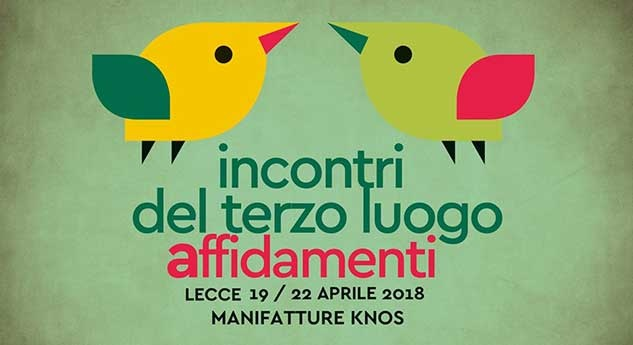

Dal 19 al 22 Aprile 2018

Affidabile è chi si affida.
Se fidarsi vuol dire arrischiarsi, è da questa scommessa che nasce amicizia.
Non ci fidiamo per poter stare insieme, ma siamo insieme perché ci fidiamo.
Se diffidare è bene, fidarsi è meglio.

Cosa significa affidare un bene pubblico ai cittadini che lo vivono? Come si può fare in modo che si sentano sempre più coinvolti? Come possiamo noi stessi affidare spazi ad altri senza aspettare i tempi della pubblica amministrazione?

Dai progetti ai luoghi, dai luoghi alle persone: in questa edizione degli Incontri vogliamo approfondire con le relazioni che si innescano nel terzo luogo, accompagnati e supportati da Krill Magazine, Apulia Film Commission, Toc Centre, Domicilio Rodogallo, Chourmo, Terminalia, Sementerie Artistiche, AAltra, Alternata e tanti altri.

**TESTIMONIANZE**

Ci sono luoghi, persone, situazioni che in qualche modo hanno a che fare con gli Incontri del terzo luogo da tanto, da poco, da sempre. Più che una rete, un incontro di amicizie. Apriremo con loro, in vista di fruttuose e nuove contaminazioni.

**TOC-Centre**
Un centro di produzione culturale all’interno della Torre dell’Orologio di Copertino. Porta avanti, attraverso momenti formativi, lecture, studio visit e programmi di residenza, una riflessione sulla fruibilità delle pratiche contemporanee attraverso i linguaggi delle immagini in movimento e delle arti narrative (time based arts). 

https://toc-centre.org | https://www.facebook.com/toccentre/

**Terminalia**
Nato nell'entroterra tra la provincia di Fermo e Macerata, Terminalia è un cantiere itinerante che affronta il tema della custodia di un territorio marginale con un approccio nomade/stanziale. Verrà presentata la sua tappa zero, avvenuta lo scorso anno, e i suoi futuri intenti.

**Chourmo - Poesia abitata a Taranto**
“Parlate di luce”, un laboratorio per dare luogo: cedere il posto, far intervenire o seguire, lasciare in custodia. Una frequentazione spontanea e virtuosa di spazi cittadini marginali: i vicoli della Città Vecchia di Taranto o il paesaggio periferico del Fiume Galeso, bellezza naturale e contrastante decantata da Virgilio e Orazio. Un’esperienza di “poesia applicata” indissolubilmente legata al paesaggio, nel tentativo di invertire il paradigma del tradizionale intrattenimento culturale in spazi asettici.

**Filerà - Le Sementerie Artistiche a Crevalcore**
Un approccio poliedrico all'agricoltura. Dall'agricoltura industriale alla permacultura, dalla genetica alla produzione artigianale, dall'agricoltura sociale all'arte. Da 3 anni un’esperienza di riconversione di una grande azienda agricola con 1.150.000 mq di coltivazione, spazi coperti per un totale di 3.500 mq e 70 persone di capacità di accoglienza. Sementerie Artistiche organizza residenze artistiche (teatro, danza e musica), corsi settimanali o intensivi (acrobatica, teatro, musica, danza, crescita personale), stagioni teatrali (una invernale e una estiva) e un festival di 6 settimane durante l'estate, dando spazio ad animali e piante spontanee. In atto, la riconversione di 17.000 metri quadri di terreno agricolo industriale con un progetto pilota di agricoltura sociale. Mentre lo sguardo volge al centro storico di Crevalcore, in semi-abbandono a causa del sisma.
 
http://www.sementerieartistiche.it/
 
**Domicilio Rodogallo**
Un trullo, quattro roulotte e qualche tenda dove accogliere i viandanti. Un campo nomade temporaneo, nato durante l’estate del 2014 nel Parco della Montagna Spaccata - Rupi di San Mauro a Gallipoli. Un laboratorio artistico di ricerca che si interroga su come influisca l’ambiente nei processi di scambio interpersonale. Ogni anno, artisti, filosofi, paesaggisti, sono invitati ad abitare il campo e a condurre una loro ricerca sull’ospitalità, adottando la pratica del disimparare. Un processo a lungo termine per sviluppare un luogo comune.
