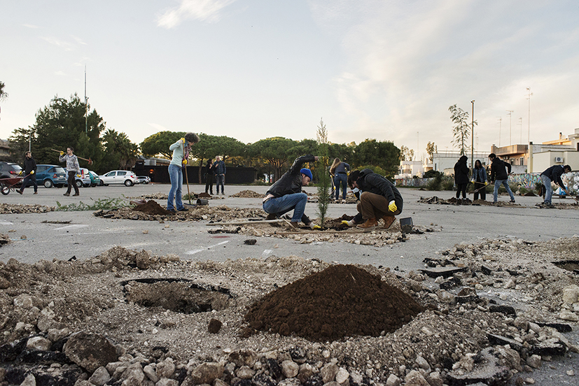
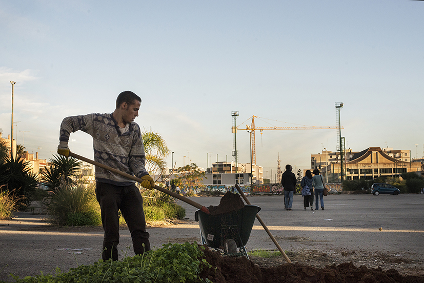
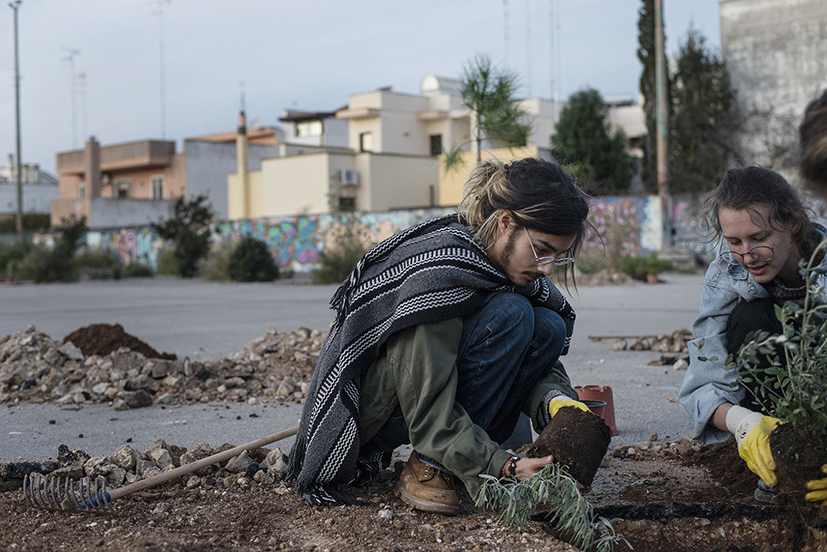
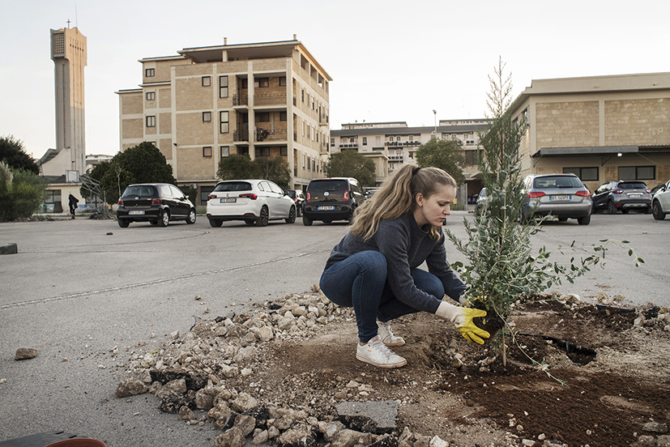
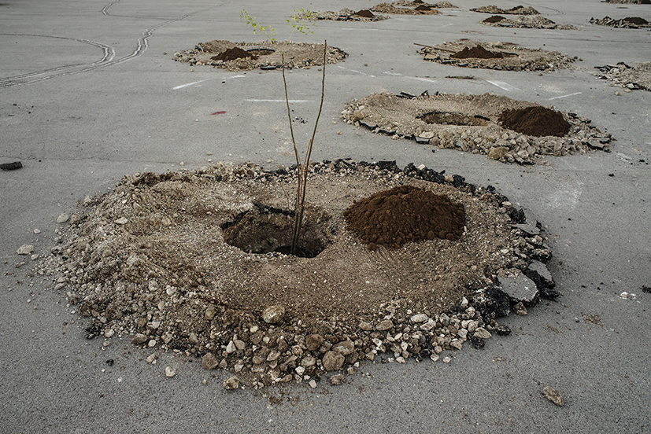
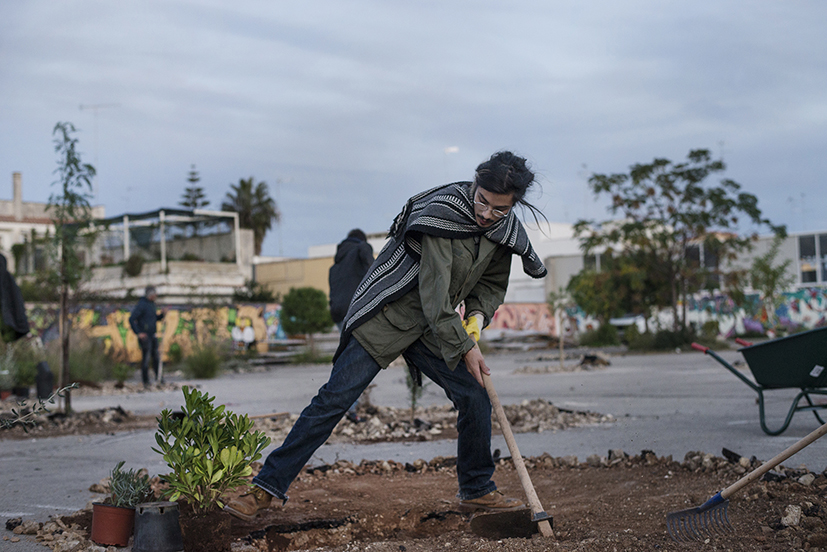
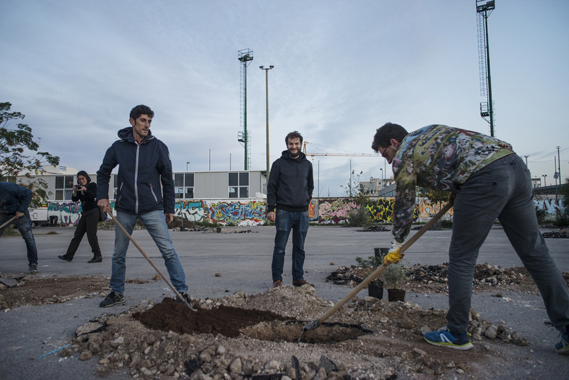
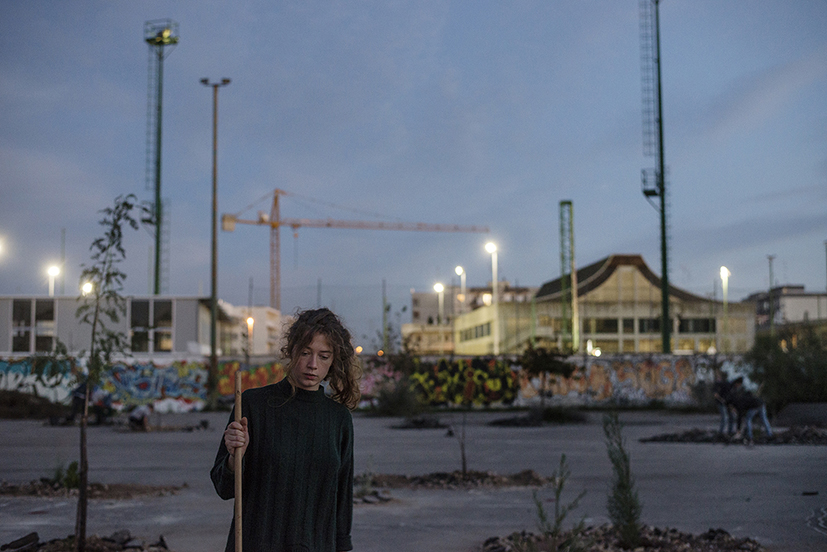

_Dal 14 al 18 novembre 2018_

Approdare o farsi approdo?

Su un molo ci si attracca, ma non si approda.
Ci vuole una caletta, una spiaggia libera, un luogo ospitale per sbarchi e naufragi. Un porto naturale per partenze e arrivi.
Dove ciò che conta è chi porta, lascia, prende o porta via.
E se approdare volesse dire che ci si è fatti approdo?

Come quando una barca sgangherata salpa speranzosa contro sicura tempesta.
E dopo il naufragio, neanche un filo di vento. In mezzo al mare.
Poche scorte e la barca da riparare.
Tra una deriva e un’altra, una mattina, l’ipotesi di un’isola.
Sorriso indigeno e quell’aria così esotica...

Saranno con noi: Patrick Bouchain, architetto e scenografo; Pablo e Miguel Georgieff del collettivo di paesaggisti argentino-francese Coloco AndCo; Elefterios Kechagioglou, del board di Trans Europe Halles (TEH) e direttore di Le Plus Petit Cirque du Monde; Sandy Fitzgerald, co-direttore dell’agenzia culturale londinese Olivearte; Stefano Minerva, presidente della Provincia di Lecce; Luigi De Luca, direttore Museo Provinciale Sigismondo Castromediano - Lecce; Roberto Covolo, assessore alla programmazione economica comune di Brindisi; Antonella Agnoli, assessore alla cultura comune di Lecce; Gabriella Riccio, Ex Asilo Filangeri di Napoli; Le Wonders, collettivo artistico dalla banlieue parigina; Pierre-Alexandre Luyt, Audencia business school; il performer Roberto Dell’Orco e tanti altri amici e ospiti.

Durante la settimana di lavoro ci confronteremo con il quartiere attraverso momenti performativi che si svilupperanno negli spazi delle Manifatture Knos e nell’area del parcheggio con un nuovo appuntamento di Asfalto Mon Amour.

Durante gli Incontri del Terzo Luogo ci interrogheremo sul valore culturale, sociale ed economico generato dal recupero dei beni comuni e indagheremo il ruolo e l'impatto dei centri culturali nella rigenerazione urbana, allargando il dibattito sia ai partecipanti degli Incontri sia ai rappresentanti delle istituzioni locali (Comune di Lecce, Provincia di Lecce e Regione Puglia).

Come nasce un centro culturale e come si evolve nel tempo? Come la ricerca di azione e autonomia può portare al recupero temporaneo di spazi dismessi e periferici volti alla produzione artistica? Come questi spazi possono favorire la nascita di pratiche mutualistiche ed egualitarie? Come si può trasformare un parcheggio in uno spazio di produzione artistica?

Queste alcune delle domande che ci accompagneranno nel corso delle giornate in cui, tra azioni e discussioni ci interrogheremo anche sul futuro delle Manifatture Knos.

In collaborazione con

L’Ecole Nationale Supérieure d’Architecture de Paris La Villette, DiARC Università Federico II Napoli, Rete Italiana Centri Culturali Indipendenti (RICCI), Trans Europe Halles (TEH), COLOCO, Labuat Taranto, Comune di Lecce, Provincia di Lecce, Apulia Film Commission, Ciclofficina Popolare Knos di Lecce, Krill Academy, The Sprockets, The Bridge Crane.

Con il sostegno di 

Creative Lenses - Creative Europe Programme e Knos Orchestra Senza Confini - Presidenza del Consiglio dei Ministri

