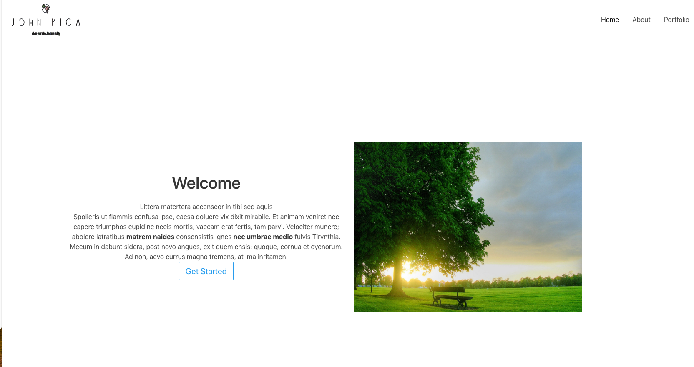

# Bulma Portfolio Theme

The **Bulma Portfolio** Theme is for [Grav CMS](http://github.com/getgrav/grav).  

## Description

Bulma Portfolio Theme includes

- Bulma forms 
- Carousel
- Testimonials
- Product Modals

Almost all have beenn done to be changed and updated from the Admin UI (tabs and options to select items)

For any bugs / features dont hesitate to open an issue and suggest them

## Usage

Most components have been built using Blueprints and thus simplifying the end-user experience and magically appear in the front-end :)

Carousels  => end user can select images, add text, buttons, etc ... 

Features  => end user can add as many as needed, select Font-Awesome icons, add text, links, etc ...

Products / Portfolio items => end user ads images, descriptions, categories, etc ...

Forms => most Bulma fields have been ported to the theme, but more are welcomed